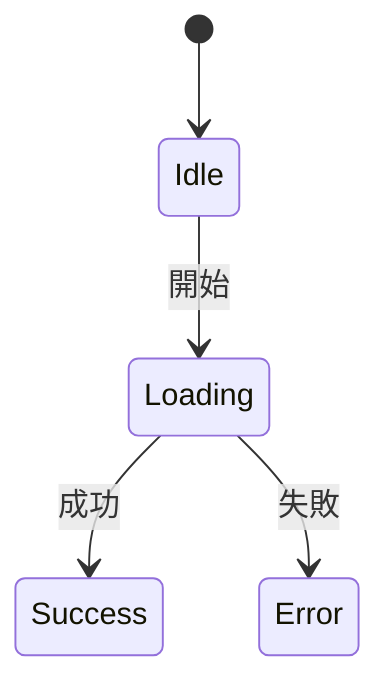
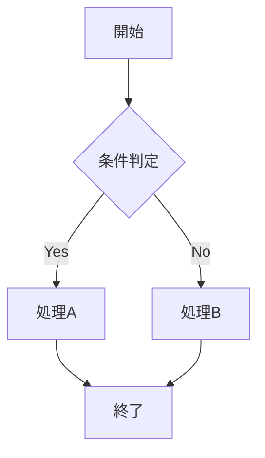

# ワークフロー強制ルール

このプロジェクトではワークフロープラグインを採用しており、フェーズをスキップすることは禁止されている。

---

## 禁止行為（違反時はフックによりブロック）

```
┌─────────────────────────────────────────────────────────────┐
│  以下の行為は全てブロックされる                              │
├─────────────────────────────────────────────────────────────┤
│  - タスク開始なしでコードを編集                              │
│  - 調査フェーズから直接実装                                  │
│  - 仕様書作成なしで実装                                      │
│  - テスト設計なしで実装                                      │
│  - レビュー承認なしで次フェーズに進む                        │
│  - ステートマシン図/フローチャートなしで設計完了宣言         │
│  - 同一ファイルの繰り返し編集（5回以上/5分）                 │
└─────────────────────────────────────────────────────────────┘
```

---

## フェーズ順序

### フェーズ構成（18フェーズ）

全てのタスクは以下の18フェーズで実行されます。

```
research → requirements → parallel_analysis（threat_modeling + planning）
→ parallel_design（state_machine + flowchart + ui_design）
→ design_review【AIレビュー + ユーザー承認】
→ test_design → test_impl → implementation → refactoring
→ parallel_quality（build_check + code_review）→ testing
→ parallel_verification（manual_test + security_scan + performance_test + e2e_test）
→ docs_update → commit → push → ci_verification → deploy → completed
```

注: small/mediumサイズは廃止されました。品質管理の一貫性を保つため、全てのタスクで完全なワークフローを実行します。

---

## TDDサイクル

```
┌─────────────────────────────────────────────────────────────┐
│                      TDD サイクル                            │
├─────────────────────────────────────────────────────────────┤
│                                                             │
│   test_impl (Red)  →  implementation (Green)  →  refactoring│
│        ↓                      ↓                      ↓      │
│   テスト作成            テストを通す実装       コード品質改善 │
│    （失敗）                 （成功）           （テスト維持） │
│                                                             │
└─────────────────────────────────────────────────────────────┘
```

---

## フェーズごとの編集可能ファイル

| フェーズ | 編集可能 | 禁止 |
|---------|---------|------|
| idle | なし | 全てのファイル |
| research | .md（読み取り中心） | コード |
| requirements | .md | コード |
| parallel_analysis | .md | コード |
| parallel_design | .md, .mmd | コード |
| design_review | .md | コード |
| test_design | .md, テストファイル | ソースコード |
| test_impl | テストファイル, .md | ソースコード |
| implementation | ソースコード | テストファイル |
| refactoring | コード全般 | - |
| parallel_quality | コード全般 | - |
| testing | .md, テストファイル | ソースコード |
| parallel_verification | .md | コード |
| docs_update | .md, .mdx | コード |
| commit | なし | 全て |
| push | なし | 全て |
| ci_verification | .md | コード |
| deploy | .md | コード |
| completed | なし | 全て |

### サブフェーズの編集可能ファイル

| サブフェーズ | 編集可能 |
|-------------|---------|
| threat_modeling | .md |
| planning | .md |
| state_machine | .md, .mmd |
| flowchart | .md, .mmd |
| ui_design | .md, .mmd |
| build_check | 全て（ビルド修正用） |
| code_review | .md |
| manual_test | .md |
| security_scan | .md |
| performance_test | .md |
| e2e_test | .md, テストファイル |

---

## フェーズ詳細説明

### docs_update（ドキュメント更新フェーズ）

実装・テスト完了後にドキュメントを更新するフェーズ。

**目的:**
- 仕様書への実装内容の反映
- README・変更履歴の更新
- API ドキュメントの更新

**成果物:**
- 更新された仕様書（`docs/product/`）
- 更新されたREADME（必要に応じて）
- 変更履歴（CHANGELOG.md など）

**編集可能ファイル:** `.md`, `.mdx`

### ci_verification（CI検証フェーズ）

push後にCI/CDパイプラインの成功を確認するフェーズ。

**目的:**
- CI/CDパイプラインの実行結果を確認
- ビルド・テスト・lint等の自動チェック結果を確認
- 失敗時は原因を特定し修正

**確認項目:**
- [ ] ビルドが成功しているか
- [ ] テストが全てパスしているか
- [ ] lint/静的解析が通っているか
- [ ] セキュリティスキャンに問題がないか

**編集可能ファイル:** `.md`（CI結果の記録のみ）

### performance_test（パフォーマンステスト）

parallel_verification のサブフェーズ。パフォーマンス要件の検証を行う。

**目的:**
- レスポンス時間の計測
- メモリ使用量の確認
- 負荷テストの実施（必要に応じて）

**成果物:**
- パフォーマンステスト結果（`{workflowDir}/performance-test.md`）

### e2e_test（E2Eテスト）

parallel_verification のサブフェーズ。エンドツーエンドテストを実行する。

**目的:**
- ユーザーシナリオの検証
- フロントエンド・バックエンド統合の確認
- クロスブラウザテスト（該当する場合）

**成果物:**
- E2Eテスト結果（`{workflowDir}/e2e-test.md`）

**編集可能ファイル:** `.md`, テストファイル（`.test.ts`, `.spec.ts` 等）

---

## 必須コマンド

| コマンド | 説明 |
|---------|------|
| `/workflow start <タスク名>` | タスクを開始（常に18フェーズで実行） |
| `/workflow next` | 次のフェーズへ進む |
| `/workflow status` | 現在の状態を確認 |
| `/workflow approve design` | 設計レビューを承認（design_reviewフェーズのみ） |
| `/workflow reset [理由]` | research フェーズにリセット |
| `/workflow list` | アクティブなタスク一覧 |
| `/workflow switch <task-id>` | 別のタスクに切り替え |
| `/workflow complete-sub <サブフェーズ>` | 並列フェーズのサブフェーズを完了 |

---

## AIへの厳命

1. **researchフェーズでコードを書いてはいけない**
2. **仕様書を書く前に実装を始めてはいけない**
3. **テストを書く前に実装を始めてはいけない（TDD Red → Green）**
4. **ユーザーに「〜していいですか？」と聞くのではなく、ワークフローに従え**
5. **調査結果をもとに「すぐに修正します」は禁止。まず仕様書を書け**
6. **脅威モデリングを省略してはいけない（Largeタスク時）**
7. **design_reviewフェーズでは必ずユーザー承認を待つ**
8. **同一ファイルを繰り返し編集する場合は立ち止まって原因を分析**
9. **「実装完了」と「タスク完了」を混同してはいけない**
   - `implementation`フェーズ終了 = 「コード作成完了」（品質確認フェーズが残っている）
   - `completed`フェーズ到達 = 「タスク完了」
   - 「できました」「完了しました」は`completed`フェーズでのみ使用可能
10. **「実行してみてください」は testing または parallel_verification フェーズ以降でのみ使用**
    - implementation 後に動作確認を促してはいけない
    - 必ず refactoring → parallel_quality を経てから
11. **各フェーズ完了時は残りのフェーズ数と次のフェーズを報告すること**
    - 例: 「implementationフェーズが完了しました。次は refactoring → 残り9フェーズ」

---

## 完了宣言ルール

### 使用禁止フレーズ（completedフェーズ以外）

| フェーズ | 許可される表現 | 禁止される表現 |
|---------|---------------|---------------|
| implementation | 「コード作成が完了」「implementationフェーズ終了」 | 「実装できました」「動作確認してください」「実行してみてください」 |
| refactoring | 「リファクタリング完了」 | 「完了しました」 |
| testing | 「テストが通りました」「テスト完了」 | 「完了しました」 |
| parallel_verification | 「検証フェーズ完了」 | 「全て完了」 |

### completedフェーズでのみ使用可能な表現

- 「タスクが完了しました」
- 「実装が完了しました」
- 「実行してみてください」
- 「動作確認できます」

### フェーズ完了報告テンプレート

```
【{フェーズ名}フェーズ完了】
- 完了した作業: {作業内容}
- 次のフェーズ: {次フェーズ名}
- 残りフェーズ数: {数}フェーズ
```

---

## 仕様駆動開発（SDD）ルール

### 開発フロー

```
1. 要件定義 → 2. 設計 → 3. タスク分解 → 4. 実装 → 5. レビュー
     ↓              ↓           ↓            ↓           ↓
  仕様書作成    API仕様作成   Issue登録    コード実装   チェックリスト確認
```

### 実装前の必須事項

1. **新機能**: `docs/product/features/` に仕様書を作成してから実装
2. **API変更**: `docs/product/api/` にAPI仕様を記述してから実装
3. **UI変更**: `docs/product/screens/` に画面仕様を記述してから実装
4. **重要な設計判断**: `docs/architecture/decisions/` にADRを作成

### 禁止事項

- **仕様書なしで新機能を実装しない**
- **@spec コメントなしで新規ファイルを作成しない**

---

## コードと仕様書の紐付けルール

新規ファイル作成時は必ず `@spec` コメントを追加すること。

```typescript
/**
 * コンポーネント/サービス名
 * @spec docs/workflows/xxx.md       // ワークフロー成果物
 * @spec docs/product/api/xxx.md     // API仕様書（APIの場合）
 * @spec docs/product/screens/xxx.md // 画面仕様書（画面の場合）
 */
```

### 仕様書フォーマット

```markdown
## 関連ファイル

<!-- @related-files -->
- `src/backend/application/use_cases/example/`
- `src/frontend/features/example/`
<!-- @end-related-files -->
```

---

## 並列フェーズ

並列実行可能なフェーズグループ。

| グループ | サブフェーズ |
|---------|-------------|
| `parallel_analysis` | threat_modeling, planning |
| `parallel_design` | state_machine, flowchart, ui_design |
| `parallel_quality` | build_check, code_review |
| `parallel_verification` | manual_test, security_scan, performance_test, e2e_test |

サブフェーズの完了:

```
/workflow complete-sub threat_modeling
/workflow complete-sub planning
```

全サブフェーズ完了後に `/workflow next` で次フェーズへ進む。

---

## 推奨プロジェクト構造

エンタープライズレベルのプロジェクト構造。フロントエンドとバックエンドを分離。

### 全体構成

```
project/
├── src/
│   ├── frontend/         # フロントエンド（React/Next.js + Storybook）
│   └── backend/          # バックエンド（Python/FastAPI - Clean Architecture）
├── docs/                 # ドキュメント
├── e2e/                  # E2Eテスト
├── docker-compose.yml    # ローカル開発環境
└── README.md
```

---

### フロントエンド構成（Feature-First + CDD）

```
src/frontend/
├── .storybook/                   # Storybook設定
│
├── app/                          # Next.js App Router
│   ├── (routes)/                 # ルーティング
│   │   ├── (auth)/               # 認証が必要なページ
│   │   └── (public)/             # 公開ページ
│   ├── layout.tsx
│   └── providers.tsx
│
├── features/                     # 機能モジュール（★メイン）
│   └── {feature}/                # 例: checkout, auth, dashboard
│       ├── components/           # 機能固有コンポーネント
│       │   └── {Component}/
│       │       ├── index.ts
│       │       ├── {Component}.tsx
│       │       ├── {Component}.stories.tsx  # CDD
│       │       ├── {Component}.test.tsx     # TDD
│       │       └── {Component}.module.css
│       ├── hooks/                # 機能固有フック
│       │   └── use{Feature}.ts
│       ├── api/                  # API呼び出し
│       │   └── {feature}.api.ts
│       ├── stores/               # 状態管理
│       │   └── {feature}.store.ts
│       ├── types/                # 型定義
│       │   └── {feature}.types.ts
│       └── index.ts              # barrel export
│
├── components/                   # 共通UIコンポーネント
│   ├── ui/                       # デザインシステム実装
│   │   ├── Button/
│   │   │   ├── index.ts
│   │   │   ├── Button.tsx
│   │   │   ├── Button.stories.tsx
│   │   │   ├── Button.test.tsx
│   │   │   └── Button.module.css
│   │   ├── Input/
│   │   ├── Modal/
│   │   └── index.ts
│   └── layouts/                  # レイアウト
│       ├── Header/
│       ├── Sidebar/
│       └── Footer/
│
├── hooks/                        # 共通フック
│   ├── useMediaQuery.ts
│   └── useDebounce.ts
│
├── lib/                          # ユーティリティ
│   ├── api-client.ts             # APIクライアント
│   ├── utils/
│   └── validations/
│
├── styles/                       # グローバルスタイル
│   ├── globals.css
│   ├── tokens.css                # デザイントークン
│   └── reset.css
│
├── types/                        # グローバル型定義
│   └── global.d.ts
│
├── test/                         # フロントエンドテスト
│   └── {feature}.spec.ts
│
└── package.json
```

**Co-location原則**: コンポーネント・ストーリー・テスト・スタイルを同一フォルダに配置

---

### バックエンド構成（Clean Architecture + DDD）

```
src/backend/
├── main.py                       # エントリーポイント
│
├── domain/                       # ドメイン層（★ビジネスの核心）
│   ├── entities/                 # エンティティ
│   │   └── {entity}/
│   │       ├── {entity}.py
│   │       ├── {entity}_test.py
│   │       └── __init__.py
│   ├── value_objects/            # 値オブジェクト
│   │   └── {vo}.py
│   ├── aggregates/               # 集約
│   │   └── {aggregate}/
│   ├── events/                   # ドメインイベント
│   │   └── {event}.py
│   ├── repositories/             # リポジトリIF（Ports）
│   │   └── {entity}_repository.py
│   └── services/                 # ドメインサービス
│       └── {domain}_service.py
│
├── application/                  # アプリケーション層
│   ├── use_cases/                # ユースケース
│   │   └── {feature}/
│   │       ├── {action}_use_case.py
│   │       ├── {action}_use_case_test.py
│   │       └── __init__.py
│   ├── commands/                 # CQRS Write
│   │   └── {command}_command.py
│   ├── queries/                  # CQRS Read
│   │   └── {query}_query.py
│   ├── dtos/                     # DTO
│   │   ├── request/
│   │   └── response/
│   └── ports/                    # ポート定義
│       ├── inbound/
│       └── outbound/
│
├── infrastructure/               # インフラ層
│   ├── database/
│   │   ├── models/               # SQLAlchemy Models
│   │   ├── migrations/           # Alembic migrations
│   │   └── repositories/         # リポジトリ実装（Adapters）
│   │       └── {entity}_repository_impl.py
│   ├── external/                 # 外部API連携
│   │   └── {service}/
│   │       ├── {service}_client.py
│   │       └── {service}_adapter.py
│   ├── messaging/                # メッセージング
│   │   └── {queue}_producer.py
│   ├── cache/                    # キャッシュ
│   │   └── redis_service.py
│   └── config/                   # 設定
│       └── {config}_config.py
│
├── presentation/                 # プレゼンテーション層（API）
│   ├── routers/                  # FastAPI routers
│   │   └── {feature}/
│   │       ├── {feature}_router.py
│   │       ├── {feature}_router_test.py
│   │       └── __init__.py
│   ├── middleware/
│   │   ├── auth_middleware.py
│   │   └── logging_middleware.py
│   ├── dependencies/             # FastAPI dependencies
│   │   └── auth.py
│   └── schemas/                  # Pydantic schemas
│       └── {feature}_schema.py
│
├── batch/                        # バッチ処理
│   └── {batch}/
│       ├── {batch}_job.py
│       └── {batch}_job_test.py
│
├── shared/                       # 共通
│   ├── constants/
│   ├── utils/
│   └── exceptions/
│
└── tests/                        # 統合テスト
    ├── e2e/
    └── fixtures/
```

---

### 依存関係ルール（バックエンド）

```
┌─────────────────────────────────────────────────────────────┐
│                     依存関係の方向                          │
├─────────────────────────────────────────────────────────────┤
│                                                             │
│   Presentation → Application → Domain ← Infrastructure     │
│                                                             │
│   ※ Domain層は他の層に依存しない（純粋なビジネスロジック）  │
│   ※ Infrastructure層は依存性逆転でDomainのIFを実装         │
└─────────────────────────────────────────────────────────────┘
```

---

### ドキュメントとソースコードの対応表

**重要**: ソースコードは必ず `src/frontend/` または `src/backend/` 以下に配置すること。

| ドキュメント | フロントエンド | バックエンド |
|-------------|---------------|-------------|
| `docs/product/features/{機能}.md` | `src/frontend/features/{機能}/` | `src/backend/application/use-cases/{機能}/` |
| `docs/product/components/{コンポーネント}.md` | `src/frontend/components/ui/{コンポーネント}/` | - |
| `docs/product/screens/{画面}.md` | `src/frontend/app/(routes)/{画面}/` | - |
| `docs/product/api/{API}.md` | `src/frontend/features/{機能}/api/` | `src/backend/presentation/controllers/{機能}/` |
| `docs/product/events/{イベント}.md` | - | `src/backend/domain/events/` |
| `docs/product/database/{テーブル}.md` | - | `src/backend/infrastructure/database/` |
| `docs/architecture/modules/{モジュール}.md` | `src/frontend/features/{モジュール}/` | `src/backend/domain/` + `src/backend/application/` |
| `docs/architecture/batch/{バッチ}.md` | - | `src/backend/batch/{バッチ}/` |
| `docs/architecture/integrations/{外部}.md` | - | `src/backend/infrastructure/external/{外部}/` |

---

### フェーズ別観点

| フェーズ | フロントエンド | バックエンド |
|---------|---------------|-------------|
| requirements | 機能モジュール特定 | ドメイン境界、用語集 |
| planning | features/構成決定 | 層構成、集約単位 |
| ui_design | components/設計、Storybook定義 | - |
| state_machine | 状態管理設計 | エンティティ状態遷移 |
| test_impl | ストーリー実装、テスト実装 | ユースケーステスト |
| implementation | コンポーネント実装 | ドメイン/アプリ層実装 |

---

### 適用判断

**この構造を推奨:**
- 複数チームでの開発
- 長期メンテナンスが予想されるプロジェクト
- ビジネスロジックが複雑なアプリケーション

**簡略化を検討:**
- プロトタイプ/PoC
- 単純なCRUDアプリケーション
- 小規模なツール

---

## ドキュメント構成

プロジェクトのドキュメントは以下の構成で管理されます。

### 構成の考え方

| ディレクトリ | 役割 | 例 |
|-------------|------|-----|
| `docs/product/` | プロダクト仕様（永続的） | 機能仕様、画面仕様、API仕様 |
| `docs/workflows/` | ワークフロー成果物（作業記録） | 調査結果、設計検討、テスト設計 |
| `docs/architecture/` | システム設計 | ADR、概要、設計図 |
| `docs/security/` | セキュリティ関連 | 脅威モデル |
| `docs/testing/` | テスト関連 | テスト計画、結果 |
| `docs/operations/` | 運用関連 | 手順書、デプロイ設定 |

### ディレクトリ構成

```
docs/
├── glossary.md                      # 用語集（ドメイン辞書）
│
├── guides/                          # 開発ガイド
│   └── storybook-setup.md           # Storybookセットアップ
│
├── product/                         # プロダクト仕様（永続的な成果物）
│   ├── features/                    # 機能仕様（モジュール単位）★重要
│   │   └── {module}.md
│   ├── screens/                     # 画面設計書
│   │   └── {screen}.md
│   ├── api/                         # API仕様書
│   │   └── {api}.md
│   ├── events/                      # イベント定義
│   │   └── {event}.md
│   ├── database/                    # DB設計（ER図、テーブル定義）
│   │   └── {table}.md
│   ├── messages/                    # メッセージ設計（エラー、通知等）
│   │   └── {feature}.md
│   ├── user-stories/                # ユーザーストーリー
│   │   └── {feature}.md
│   ├── personas/                    # ペルソナ定義
│   │   └── {persona}.md
│   ├── journeys/                    # ユーザージャーニー
│   │   └── {persona}-{journey}.md
│   ├── sitemap.md                   # サイトマップ・画面遷移
│   ├── seo/                         # SEO要件
│   │   └── {screen}.md
│   ├── i18n/                        # 国際化（多言語対応）
│   │   └── {feature}.md
│   ├── design-system/               # デザインシステム ★UI設計に重要
│   │   └── overview.md
│   ├── components/                  # コンポーネント仕様
│   │   └── {component}.md
│   ├── interactions/                # インタラクション設計
│   │   └── {screen}.md
│   ├── responsive/                  # レスポンシブ設計
│   │   └── {screen}.md
│   ├── accessibility/               # アクセシビリティ要件
│   │   └── {screen}.md
│   ├── wireframes/                  # ワイヤーフレーム/モックアップ
│   │   └── {screen}-{type}.png
│   └── diagrams/                    # プロダクト設計図
│       ├── *.state-machine.mmd
│       ├── *.flowchart.mmd
│       └── *.class.mmd
│
├── architecture/                    # アーキテクチャ
│   ├── overview.md                  # 基本設計書（システム全体構成）
│   ├── performance.md               # パフォーマンス要件
│   ├── auth.md                      # 認証・認可設計
│   ├── caching.md                   # キャッシュ戦略
│   ├── decisions/                   # ADR (Architecture Decision Records)
│   │   └── NNNN-title.md
│   ├── modules/                     # モジュール詳細設計
│   │   └── {module}.md
│   ├── integrations/                # 外部インターフェース設計
│   │   └── {system}.md
│   ├── batch/                       # バッチ処理設計
│   │   └── {batch}.md
│   └── diagrams/                    # システム構成図
│       └── {name}.mmd
│
├── security/                        # セキュリティ
│   └── threat-models/
│       └── {project}.md
│
├── testing/                         # テスト
│   ├── plans/                       # テスト設計
│   │   └── {project}.md
│   └── reports/                     # テスト結果
│
├── operations/                      # 運用
│   ├── runbooks/                    # 手順書
│   ├── deployment/                  # デプロイ設定
│   ├── environments/                # 環境定義
│   └── monitoring/                  # 監視・ログ設計
│       └── {service}.md
│
└── workflows/                       # ワークフロー成果物（作業記録）
    └── {taskName}/
        ├── research.md              # 調査結果
        ├── requirements.md          # 要件定義
        ├── spec.md                  # 仕様書
        ├── threat-model.md          # 脅威モデル
        ├── state-machine.mmd        # ステートマシン図
        ├── flowchart.mmd            # フローチャート
        ├── ui-design.md             # UI設計
        └── test-design.md           # テスト設計
```

### docs/product/features/ の重要性

**機能仕様書（features/）はシステムの中核ドキュメントです。**

各モジュール/クラスごとに以下を記述します：
- 責務と目的
- インターフェース定義
- 状態遷移
- エッジケース
- 依存関係

### プロダクト仕様への反映

ワークフローで作成した成果物をプロダクト仕様に反映する場合は、手動で `docs/product/` 以下に配置します。
- 機能仕様 → `docs/product/features/{機能名}.md`
- 画面仕様 → `docs/product/screens/{画面名}.md`
- API仕様 → `docs/product/api/{API名}.md`
- 設計図 → `docs/product/diagrams/{名称}.mmd`

---


## 成果物の配置先

ワークフロー開始時に以下が自動的に作成されます:
- `workflowDir`: `.claude/state/workflows/{taskId}_{taskName}/` - 内部状態管理用
- `docsDir`: `docs/workflows/{taskName}/` - 作業成果物配置用（環境変数 `DOCS_DIR` でオーバーライド可能）

### フェーズ別ドキュメント作成ガイド

各フェーズで作成するドキュメントを**作成順序**で示します。番号順に作成してください。

**採用アプローチ: CDD（Component-Driven Development）**
- Storybookストーリーを「実装の仕様」として先に作成
- コンポーネント実装はストーリーを満たすように行う

---

### プロジェクト共通ドキュメント（初回のみ）

タスク毎ではなく、プロジェクト開始時に一度だけ作成・以降は更新のみ。

| ドキュメント | 説明 |
|-------------|------|
| `docs/glossary.md` | 用語集（ドメイン辞書） |
| `docs/product/design-system/overview.md` | デザインシステム（カラー、タイポ、スペーシング） |
| `docs/product/personas/{ペルソナ名}.md` | ペルソナ定義 |
| `docs/architecture/overview.md` | 基本設計書（システム全体構成） |
| `docs/architecture/auth.md` | 認証・認可設計 |
| `docs/architecture/performance.md` | パフォーマンス要件 |
| `docs/architecture/caching.md` | キャッシュ戦略 |
| `docs/guides/storybook-setup.md` | Storybookセットアップガイド |

---

### タスク毎のドキュメント作成

---

#### 1. research（調査フェーズ）

| 順序 | ドキュメント | 必須 | 説明 |
|:---:|-------------|:---:|------|
| 1 | `{docsDir}/research.md` | ✅ | 調査結果・既存実装の分析 |

---

#### 2. requirements（要件定義フェーズ）

| 順序 | ドキュメント | 必須 | 説明 |
|:---:|-------------|:---:|------|
| 1 | `docs/glossary.md` | - | 用語集（新規用語があれば追記） |
| 2 | `docs/product/user-stories/{機能名}.md` | - | ユーザーストーリー（〜として〜したい） |
| 3 | `docs/product/journeys/{ペルソナ}-{ジャーニー}.md` | - | ユーザージャーニーマップ |
| 4 | `docs/product/features/{機能名}.md` | ✅ | 機能仕様書 |
| 5 | `{docsDir}/requirements.md` | ✅ | 要件定義（ワークフロー成果物） |

---

#### 3. parallel_analysis（並列分析フェーズ）

##### 3a. threat_modeling

| 順序 | ドキュメント | 必須 | 説明 |
|:---:|-------------|:---:|------|
| 1 | `{docsDir}/threat-model.md` | ✅ | 脅威モデル（ワークフロー成果物） |
| 2 | `docs/security/threat-models/{プロジェクト}.md` | ✅ | 脅威モデル（エンタープライズ配置） |

##### 3b. planning

| 順序 | ドキュメント | 必須 | 説明 |
|:---:|-------------|:---:|------|
| 1 | `docs/architecture/overview.md` | - | 基本設計書（更新があれば） |
| 2 | `docs/product/database/{テーブル名}.md` | ✅ | DB設計（ER図、テーブル定義） |
| 3 | `docs/product/api/{API名}.md` | ✅ | API仕様書（エンドポイント設計） |
| 4 | `docs/product/events/{イベント名}.md` | - | イベント定義（ドメインイベント） |
| 5 | `docs/architecture/integrations/{システム名}.md` | - | 外部システム連携設計 |
| 6 | `docs/architecture/batch/{バッチ名}.md` | - | バッチ処理設計 |
| 7 | `docs/architecture/modules/{モジュール名}.md` | ✅ | モジュール詳細設計 |
| 8 | `{docsDir}/spec.md` | ✅ | 仕様書（ワークフロー成果物） |

※認証・キャッシュ・パフォーマンスはプロジェクト共通ドキュメント

---

#### 4. parallel_design（並列設計フェーズ）

##### 4a. state_machine

| 順序 | ドキュメント | 必須 | 説明 |
|:---:|-------------|:---:|------|
| 1 | `{docsDir}/state-machine.mmd` | ✅ | ステートマシン図（ワークフロー） |
| 2 | `docs/product/diagrams/{対象}.state-machine.mmd` | ✅ | ステートマシン図（エンタープライズ） |

##### 4b. flowchart

| 順序 | ドキュメント | 必須 | 説明 |
|:---:|-------------|:---:|------|
| 1 | `{docsDir}/flowchart.mmd` | ✅ | フローチャート（ワークフロー） |
| 2 | `docs/product/diagrams/{対象}.flowchart.mmd` | ✅ | フローチャート（エンタープライズ） |

##### 4c. ui_design

| 順序 | ドキュメント | 必須 | 説明 |
|:---:|-------------|:---:|------|
| 1 | `docs/product/sitemap.md` | ✅ | サイトマップ・画面遷移図（更新） |
| 2 | `docs/product/wireframes/{画面名}.png` | - | ワイヤーフレーム/モックアップ |
| 3 | `docs/product/screens/{画面名}.md` | ✅ | 画面設計書 |
| 4 | `docs/product/components/{コンポーネント名}.md` | ✅ | コンポーネント仕様 + **Storybookストーリー定義**（実装の仕様） |
| 5 | `docs/product/interactions/{画面名}.md` | - | インタラクション・アニメーション設計 |
| 6 | `docs/product/responsive/{画面名}.md` | - | レスポンシブ設計（ブレークポイント別） |
| 7 | `docs/product/accessibility/{画面名}.md` | - | アクセシビリティ要件（WCAG対応） |
| 8 | `docs/product/seo/{画面名}.md` | - | SEO要件（メタ、OGP、構造化データ） |
| 9 | `docs/product/i18n/{機能名}.md` | - | 国際化要件（多言語対応） |
| 10 | `docs/product/messages/{機能名}.md` | - | メッセージ設計（エラー、通知） |
| 11 | `{docsDir}/ui-design.md` | ✅ | UI設計（ワークフロー成果物） |

**CDD: コンポーネント仕様にStorybookストーリー定義を含める**
- どのストーリーが必要か（Default, Variants, States等）
- 各ストーリーのargs/controls定義
- インタラクションテストのシナリオ

※デザインシステムはプロジェクト共通ドキュメント

---

#### 5. design_review（設計レビューフェーズ）

ドキュメント作成なし。レビュー・承認のみ。

---

#### 6. test_design（テスト設計フェーズ）

| 順序 | ドキュメント | 必須 | 説明 |
|:---:|-------------|:---:|------|
| 1 | `docs/testing/plans/{プロジェクト}.md` | ✅ | テスト計画書 |
| 2 | `{docsDir}/test-design.md` | ✅ | テスト設計（ワークフロー成果物） |

---

#### 7. test_impl（テスト実装フェーズ）【CDD: Red Phase】

| 順序 | ドキュメント | 必須 | 説明 |
|:---:|-------------|:---:|------|
| 1 | `src/**/*.stories.tsx` | ✅ | **Storybookストーリー実装**（ui_designの仕様に基づく） |
| 2 | `src/**/*.test.ts` | ✅ | ユニットテストコード |

**CDD + TDD の融合:**
1. ui_design で定義したストーリー仕様を `.stories.tsx` として実装
2. ストーリーはまだレンダリングできない（コンポーネント未実装）= Red
3. ユニットテストも失敗する状態で作成 = Red
4. implementation フェーズでコンポーネントを実装して Green にする

---

#### 8. implementation（実装フェーズ）【CDD: Green Phase】

| 順序 | ドキュメント | 必須 | 説明 |
|:---:|-------------|:---:|------|
| 1 | `src/**/*.tsx` | ✅ | コンポーネント/モジュール実装（ストーリー・テストを通す） |
| 2 | `docs/architecture/decisions/{NNNN-title}.md` | - | ADR（実装中の重要な設計判断時） |

**CDD + TDD の融合:**
- test_impl で作成したストーリー・テストが通るように実装
- ストーリーがStorybookで正しくレンダリングされる = Green
- ユニットテストがパスする = Green

---

#### 9. refactoring（リファクタリングフェーズ）

ドキュメント作成なし。コード品質改善のみ。

---

#### 10. parallel_quality（並列品質チェックフェーズ）

##### 10a. build_check

ドキュメント作成なし。ビルドエラー修正のみ。

##### 10b. code_review

| 順序 | ドキュメント | 必須 | 説明 |
|:---:|-------------|:---:|------|
| 1 | `{docsDir}/code-review.md` | - | コードレビュー結果（指摘事項） |

---

#### 11. testing（テストフェーズ）

| 順序 | ドキュメント | 必須 | 説明 |
|:---:|-------------|:---:|------|
| 1 | `docs/testing/reports/{プロジェクト}-{日付}.md` | ✅ | テスト結果レポート |

---

#### 12. parallel_verification（並列検証フェーズ）

##### 12a. manual_test

| 順序 | ドキュメント | 必須 | 説明 |
|:---:|-------------|:---:|------|
| 1 | `{docsDir}/manual-test.md` | ✅ | 手動テスト結果 |

##### 12b. security_scan

| 順序 | ドキュメント | 必須 | 説明 |
|:---:|-------------|:---:|------|
| 1 | `{docsDir}/security-scan.md` | ✅ | セキュリティスキャン結果 |

##### 12c. performance_test

| 順序 | ドキュメント | 必須 | 説明 |
|:---:|-------------|:---:|------|
| 1 | `{docsDir}/performance-test.md` | ✅ | パフォーマンステスト結果 |

##### 12d. e2e_test

| 順序 | ドキュメント | 必須 | 説明 |
|:---:|-------------|:---:|------|
| 1 | `{docsDir}/e2e-test.md` | ✅ | E2Eテスト結果 |

---

#### 13. docs_update（ドキュメント更新フェーズ）

| 順序 | ドキュメント | 必須 | 説明 |
|:---:|-------------|:---:|------|
| 1 | `docs/architecture/overview.md` | - | 基本設計書の更新（変更があれば） |
| 2 | `docs/operations/environments/{環境名}.md` | - | 環境定義（dev/stg/prod） |
| 3 | `docs/operations/deployment/{対象}.md` | - | デプロイ手順書 |
| 4 | `docs/operations/monitoring/{サービス名}.md` | - | 監視・ログ設計 |
| 5 | `docs/operations/runbooks/{手順名}.md` | - | 運用手順書（障害対応等） |
| 6 | `docs/guides/{ガイド名}.md` | - | 開発ガイド（Storybook等） |
| 7 | `CHANGELOG.md` | - | 変更履歴 |
| 8 | `README.md` | - | README更新 |

---

### ドキュメント作成フロー図

```
┌─────────────────────────────────────────────────────────────┐
│ プロジェクト共通（初回のみ）                                 │
│   用語集、デザインシステム、ペルソナ、基本設計              │
│   認証設計、パフォーマンス要件、キャッシュ戦略              │
└─────────────────────────────────────────────────────────────┘

                    ↓ タスク開始

research: 調査
    │
    ▼
requirements: ユーザーストーリー → ジャーニー → 機能仕様
    │
    ▼
parallel_analysis ┬─ threat_modeling: 脅威モデル
                  │
                  └─ planning: DB設計 → API仕様 → イベント
                               → 外部IF → バッチ → モジュール設計
    │
    ▼
parallel_design ┬─ state_machine: ステートマシン図
                │
                ├─ flowchart: フローチャート
                │
                └─ ui_design: サイトマップ → ワイヤーフレーム
                              → 画面設計
                              → コンポーネント仕様【Storybook定義含む】
                              → インタラクション → レスポンシブ
                              → アクセシビリティ → SEO → i18n
                              → メッセージ
    │
    ▼
design_review（承認）
    │
    ▼
test_design: テスト計画 → テスト設計
    │
    ▼
┌─────────────────────────────────────────────────────────────┐
│ test_impl【CDD Red Phase】                                   │
│   1. Storybookストーリー実装（.stories.tsx）                │
│   2. ユニットテスト実装（.test.ts）                         │
│   → まだ失敗する状態（コンポーネント未実装）                │
└─────────────────────────────────────────────────────────────┘
    │
    ▼
┌─────────────────────────────────────────────────────────────┐
│ implementation【CDD Green Phase】                            │
│   コンポーネント/モジュール実装                              │
│   → ストーリー・テストが通る状態にする                      │
└─────────────────────────────────────────────────────────────┘
    │
    ▼
refactoring【Refactor Phase】
    │
    ▼
parallel_quality ┬─ build_check
                 └─ code_review
    │
    ▼
testing: テスト結果レポート
    │
    ▼
parallel_verification ┬─ manual_test
                      ├─ security_scan
                      ├─ performance_test
                      └─ e2e_test
    │
    ▼
docs_update: 環境定義 → デプロイ手順 → 監視設計
             → 運用手順 → ガイド → CHANGELOG → README
    │
    ▼
commit → push → ci_verification → deploy → completed
```

### CDD + TDD サイクル

```
┌─────────────────────────────────────────────────────────────┐
│                    CDD + TDD サイクル                        │
├─────────────────────────────────────────────────────────────┤
│                                                             │
│  ui_design          test_impl           implementation      │
│  ┌─────────┐       ┌─────────┐         ┌─────────┐         │
│  │ストーリー│  →   │ストーリー│   →    │コンポーネント│     │
│  │  定義   │       │  実装   │         │   実装   │         │
│  │ (仕様)  │       │ (Red)   │         │ (Green)  │         │
│  └─────────┘       └─────────┘         └─────────┘         │
│       ↓                 ↓                   ↓               │
│  コンポーネント     .stories.tsx        .tsx ファイル        │
│  仕様書に記述       ファイル作成        ストーリーが通る     │
│                                                             │
└─────────────────────────────────────────────────────────────┘
```

### 命名規則

**重要**: ファイル名にはタスク名ではなく、対象の名前を使用する。

| カテゴリ | ルール | 例 |
|---------|--------|-----|
| 機能仕様 | 機能名（kebab-case） | `user-authentication.md` |
| 画面仕様 | 画面名（kebab-case） | `login-screen.md` |
| API仕様 | API名（kebab-case） | `users-api.md` |
| イベント定義 | イベント名（kebab-case） | `order-created.md` |
| DB設計 | テーブル名（kebab-case） | `users.md`, `orders.md` |
| モジュール設計 | モジュール名（kebab-case） | `payment-service.md` |
| 設計図 | 対象名.種類.mmd | `order.state-machine.mmd` |
| 脅威モデル | プロジェクト/機能名 | `payment-system.md` |
| テスト計画 | プロジェクト/機能名 | `checkout-flow.md` |
| テスト結果 | プロジェクト-日付 | `checkout-20260118.md` |
| ADR | 連番-タイトル | `0001-use-postgresql.md` |
| 運用手順 | 手順名 | `incident-response.md` |
| ユーザーストーリー | 機能名（kebab-case） | `checkout.md` |
| ペルソナ | ペルソナ名（kebab-case） | `power-user.md` |
| ユーザージャーニー | ペルソナ-ジャーニー | `power-user-purchase.md` |
| コンポーネント仕様 | コンポーネント名（kebab-case） | `button.md`, `modal.md` |
| インタラクション設計 | 画面名（kebab-case） | `checkout-screen.md` |
| レスポンシブ設計 | 画面名（kebab-case） | `dashboard.md` |
| アクセシビリティ | 画面名（kebab-case） | `form-screen.md` |
| SEO要件 | 画面名（kebab-case） | `product-page.md` |
| 国際化要件 | 機能名（kebab-case） | `checkout.md` |
| 監視・ログ設計 | サービス名（kebab-case） | `api-server.md` |

### diagrams ディレクトリの使い分け

| ディレクトリ | 用途 | 例 |
|-------------|------|-----|
| `docs/architecture/diagrams/` | システム全体の構成図 | インフラ構成、デプロイ構成、サービス間連携 |
| `docs/product/diagrams/` | プロダクト機能の設計図 | 機能のステートマシン、処理フロー、画面遷移 |

### ワークフロー成果物の例

```
docs/workflows/
└── テトリスWebゲーム/
    ├── research.md           # 調査結果
    ├── requirements.md       # 要件定義
    ├── spec.md               # 仕様書
    ├── threat-model.md       # 脅威モデル
    ├── state-machine.mmd     # ステートマシン図
    ├── flowchart.mmd         # フローチャート
    ├── ui-design.md          # UI設計
    └── test-design.md        # テスト設計
```

### エンタープライズ配置の例

```
docs/
├── product/
│   ├── features/
│   │   └── tetris-game.md           # ← requirements で作成
│   ├── screens/
│   │   └── game-screen.md           # ← ui_design で作成
│   └── diagrams/
│       ├── tetris.state-machine.mmd # ← state_machine で作成
│       └── tetris.flowchart.mmd     # ← flowchart で作成
├── security/
│   └── threat-models/
│       └── tetris-game.md           # ← threat_modeling で作成
└── testing/
    └── plans/
        └── tetris-game.md           # ← test_design で作成
```

---

## 環境変数（オーバーライド用）

| 変数名 | 説明 |
|--------|------|
| `DOCS_BASE` | ドキュメントのベースディレクトリ（デフォルト: `docs/`） |
| `DOCS_DIR` | ワークフロー成果物ディレクトリ（デフォルト: `docs/workflows/`） |
| `STATE_DIR` | 内部状態ディレクトリ（デフォルト: `.claude/state/`） |
| `SKIP_PHASE_GUARD=true` | フェーズ編集制限を無効化（非推奨） |
| `SKIP_SPEC_GUARD=true` | 仕様ファーストチェックを無効化（非推奨） |
| `SKIP_LOOP_DETECTION=true` | 無限ループ検出を無効化（非推奨） |
| `SKIP_ARTIFACT_CHECK=true` | 成果物反映チェックを無効化（非推奨） |

**注意**: これらのスキップは監査証跡として記録される。

---

## 図式設計（Mermaid形式で記述）

機能実装前に適切な図を作成すること。**全てMermaid形式で記述する。**

### UI・状態管理 → ステートマシン図（`stateDiagram-v2`）



### 処理・ビジネスロジック → フローチャート（`flowchart`）


