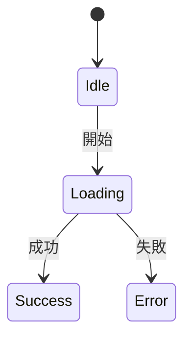
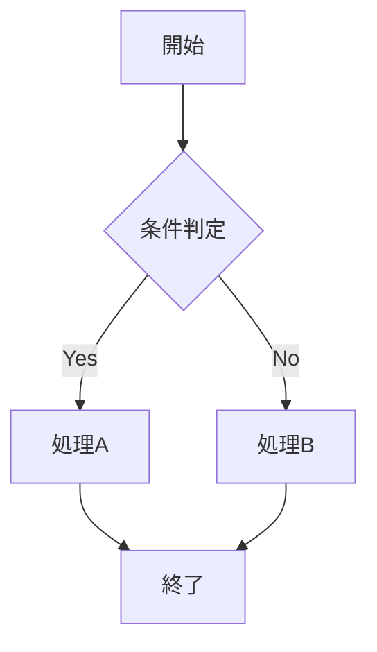

# ワークフロー強制ルール

このプロジェクトではワークフロープラグインを採用しており、フェーズをスキップすることは禁止されている。

---

## 禁止行為（違反時はフックによりブロック）

```
┌─────────────────────────────────────────────────────────────┐
│  以下の行為は全てブロックされる                              │
├─────────────────────────────────────────────────────────────┤
│  - タスク開始なしでコードを編集                              │
│  - 調査フェーズから直接実装                                  │
│  - 仕様書作成なしで実装                                      │
│  - テスト設計なしで実装                                      │
│  - レビュー承認なしで次フェーズに進む                        │
│  - ステートマシン図/フローチャートなしで設計完了宣言         │
│  - 同一ファイルの繰り返し編集（5回以上/5分）                 │
└─────────────────────────────────────────────────────────────┘
```

---

## フェーズ順序

### フェーズ構成（18フェーズ）

全てのタスクは以下の18フェーズで実行されます。

```
research → requirements → parallel_analysis（threat_modeling + planning）
→ parallel_design（state_machine + flowchart + ui_design）
→ design_review【AIレビュー + ユーザー承認】
→ test_design → test_impl → implementation → refactoring
→ parallel_quality（build_check + code_review）→ testing
→ parallel_verification（manual_test + security_scan + performance_test + e2e_test）
→ docs_update → commit → push → ci_verification → deploy → completed
```

注: small/mediumサイズは廃止されました。品質管理の一貫性を保つため、全てのタスクで完全なワークフローを実行します。

---

## TDDサイクル

```
┌─────────────────────────────────────────────────────────────┐
│                      TDD サイクル                            │
├─────────────────────────────────────────────────────────────┤
│                                                             │
│   test_impl (Red)  →  implementation (Green)  →  refactoring│
│        ↓                      ↓                      ↓      │
│   テスト作成            テストを通す実装       コード品質改善 │
│    （失敗）                 （成功）           （テスト維持） │
│                                                             │
└─────────────────────────────────────────────────────────────┘
```

---

## フェーズごとの編集可能ファイル

| フェーズ | 編集可能 | 禁止 |
|---------|---------|------|
| idle | なし | 全てのファイル |
| research | .md（読み取り中心） | コード |
| requirements | .md | コード |
| parallel_analysis | .md | コード |
| parallel_design | .md, .mmd | コード |
| design_review | .md | コード |
| test_design | .md, テストファイル | ソースコード |
| test_impl | テストファイル, .md | ソースコード |
| implementation | ソースコード | テストファイル |
| refactoring | コード全般 | - |
| parallel_quality | コード全般 | - |
| testing | .md, テストファイル | ソースコード |
| parallel_verification | .md | コード |
| docs_update | .md, .mdx | コード |
| commit | なし | 全て |
| push | なし | 全て |
| ci_verification | .md | コード |
| deploy | .md | コード |
| completed | なし | 全て |

### サブフェーズの編集可能ファイル

| サブフェーズ | 編集可能 |
|-------------|---------|
| threat_modeling | .md |
| planning | .md |
| state_machine | .md, .mmd |
| flowchart | .md, .mmd |
| ui_design | .md, .mmd |
| build_check | 全て（ビルド修正用） |
| code_review | .md |
| manual_test | .md |
| security_scan | .md |
| performance_test | .md |
| e2e_test | .md, テストファイル |

---

## フェーズ詳細説明

### docs_update（ドキュメント更新フェーズ）

実装・テスト完了後にドキュメントを更新するフェーズ。

**目的:**
- 仕様書への実装内容の反映
- README・変更履歴の更新
- API ドキュメントの更新

**成果物:**
- 更新された仕様書（`docs/specs/`）
- 更新されたREADME（必要に応じて）
- 変更履歴（CHANGELOG.md など）

**編集可能ファイル:** `.md`, `.mdx`

### ci_verification（CI検証フェーズ）

push後にCI/CDパイプラインの成功を確認するフェーズ。

**目的:**
- CI/CDパイプラインの実行結果を確認
- ビルド・テスト・lint等の自動チェック結果を確認
- 失敗時は原因を特定し修正

**確認項目:**
- [ ] ビルドが成功しているか
- [ ] テストが全てパスしているか
- [ ] lint/静的解析が通っているか
- [ ] セキュリティスキャンに問題がないか

**編集可能ファイル:** `.md`（CI結果の記録のみ）

### performance_test（パフォーマンステスト）

parallel_verification のサブフェーズ。パフォーマンス要件の検証を行う。

**目的:**
- レスポンス時間の計測
- メモリ使用量の確認
- 負荷テストの実施（必要に応じて）

**成果物:**
- パフォーマンステスト結果（`{workflowDir}/performance-test.md`）

### e2e_test（E2Eテスト）

parallel_verification のサブフェーズ。エンドツーエンドテストを実行する。

**目的:**
- ユーザーシナリオの検証
- フロントエンド・バックエンド統合の確認
- クロスブラウザテスト（該当する場合）

**成果物:**
- E2Eテスト結果（`{workflowDir}/e2e-test.md`）

**編集可能ファイル:** `.md`, テストファイル（`.test.ts`, `.spec.ts` 等）

---

## 必須コマンド

| コマンド | 説明 |
|---------|------|
| `/workflow start <タスク名>` | タスクを開始（常に18フェーズで実行） |
| `/workflow next` | 次のフェーズへ進む |
| `/workflow status` | 現在の状態を確認 |
| `/workflow approve design` | 設計レビューを承認（design_reviewフェーズのみ） |
| `/workflow reset [理由]` | research フェーズにリセット |
| `/workflow list` | アクティブなタスク一覧 |
| `/workflow switch <task-id>` | 別のタスクに切り替え |
| `/workflow complete-sub <サブフェーズ>` | 並列フェーズのサブフェーズを完了 |

---

## AIへの厳命

1. **researchフェーズでコードを書いてはいけない**
2. **仕様書を書く前に実装を始めてはいけない**
3. **テストを書く前に実装を始めてはいけない（TDD Red → Green）**
4. **ユーザーに「〜していいですか？」と聞くのではなく、ワークフローに従え**
5. **調査結果をもとに「すぐに修正します」は禁止。まず仕様書を書け**
6. **脅威モデリングを省略してはいけない（Largeタスク時）**
7. **design_reviewフェーズでは必ずユーザー承認を待つ**
8. **同一ファイルを繰り返し編集する場合は立ち止まって原因を分析**

---

## 仕様駆動開発（SDD）ルール

### 開発フロー

```
1. 要件定義 → 2. 設計 → 3. タスク分解 → 4. 実装 → 5. レビュー
     ↓              ↓           ↓            ↓           ↓
  仕様書作成    API仕様作成   Issue登録    コード実装   チェックリスト確認
```

### 実装前の必須事項

1. **新機能**: `docs/specs/` に仕様書を作成してから実装
2. **API変更**: `docs/specs/api/` にAPI仕様を記述してから実装
3. **UI変更**: 期待するUIの説明またはモックを提示してから実装
4. **重要な設計判断**: `docs/decisions/` にADRを作成

### 禁止事項

- **仕様書なしで新機能を実装しない**
- **@spec コメントなしで新規ファイルを作成しない**

---

## コードと仕様書の紐付けルール

新規ファイル作成時は必ず `@spec` コメントを追加すること。

```typescript
/**
 * コンポーネント/サービス名
 * @spec docs/specs/domains/xxx.md   // ドメイン仕様書
 * @spec docs/specs/api/xxx.md       // API仕様書（APIの場合）
 * @spec docs/specs/ui/xxx.md        // UI仕様書（画面の場合）
 */
```

### 仕様書フォーマット

```markdown
## 関連ファイル

<!-- @related-files -->
- `src/services/example.ts`
- `src/pages/ExamplePage.tsx`
<!-- @end-related-files -->
```

---

## 並列フェーズ

並列実行可能なフェーズグループ。

| グループ | サブフェーズ |
|---------|-------------|
| `parallel_analysis` | threat_modeling, planning |
| `parallel_design` | state_machine, flowchart, ui_design |
| `parallel_quality` | build_check, code_review |
| `parallel_verification` | manual_test, security_scan, performance_test, e2e_test |

サブフェーズの完了:

```
/workflow complete-sub threat_modeling
/workflow complete-sub planning
```

全サブフェーズ完了後に `/workflow next` で次フェーズへ進む。

---

## 成果物の配置先

| フェーズ | 成果物 | 配置先 |
|---------|--------|--------|
| research | 調査結果 | `{workflowDir}/research.md` |
| requirements | 要件定義 | `{workflowDir}/requirements.md` |
| planning | 仕様書 | `docs/specs/domains/{domain}/{name}.md` |
| threat_modeling | 脅威モデル | `{workflowDir}/threat-model.md` |
| state_machine | ステートマシン図 | `docs/specs/{domain}/{name}.state-machine.mmd` |
| flowchart | フローチャート | `docs/specs/{domain}/{name}.flowchart.mmd` |
| ui_design | UI設計 | `{workflowDir}/ui-design.md` |
| test_design | テストケース | `{workflowDir}/test-cases.md` |
| code_review | レビュー結果 | `{workflowDir}/code-review.md` |
| performance_test | パフォーマンス結果 | `{workflowDir}/performance-test.md` |
| e2e_test | E2Eテスト結果 | `{workflowDir}/e2e-test.md` |
| docs_update | ドキュメント更新 | `docs/specs/`, `README.md` |
| ci_verification | CI結果記録 | `{workflowDir}/ci-result.md` |

---

## 環境変数（オーバーライド用）

| 変数名 | 説明 |
|--------|------|
| `SKIP_PHASE_GUARD=true` | フェーズ編集制限を無効化（非推奨） |
| `SKIP_SPEC_GUARD=true` | 仕様ファーストチェックを無効化（非推奨） |
| `SKIP_LOOP_DETECTION=true` | 無限ループ検出を無効化（非推奨） |
| `SKIP_ARTIFACT_CHECK=true` | 成果物反映チェックを無効化（非推奨） |

**注意**: これらのスキップは監査証跡として記録される。

---

## 図式設計（Mermaid形式で記述）

機能実装前に適切な図を作成すること。**全てMermaid形式で記述する。**

### UI・状態管理 → ステートマシン図（`stateDiagram-v2`）



### 処理・ビジネスロジック → フローチャート（`flowchart`）


