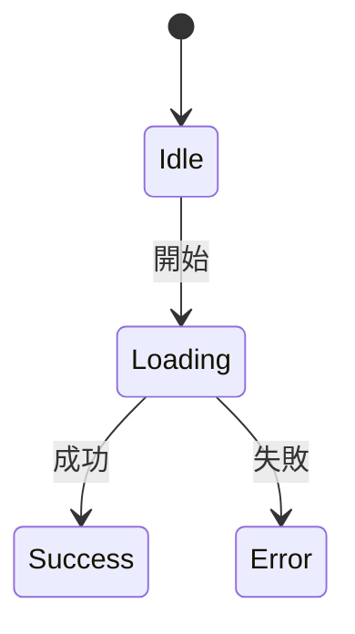
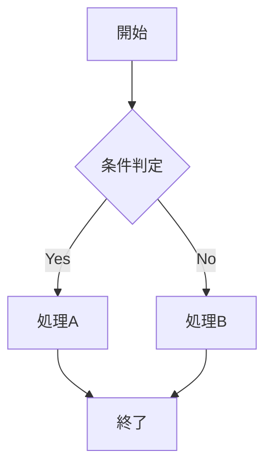

# ワークフロー強制ルール

このプロジェクトではワークフロープラグインを採用しており、フェーズをスキップすることは禁止されている。

---

## ワークフローを使うべきケース / 使わないケース

### ワークフローを使うべきケース（`/workflow start` が必要）

以下のタスクは**必ずワークフローを開始**してから実行する：

| タスク種別 | 例 |
|-----------|-----|
| 新機能の実装 | 「ログイン機能を追加」「ダッシュボードを作成」 |
| 既存機能の大幅な変更 | 「認証方式をJWTに変更」「APIのURL構造を変更」 |
| 新しいAPIエンドポイントの追加 | 「ユーザー一覧APIを追加」 |
| バグ修正（コード変更を伴う） | 「〜のバグを修正して」 |
| リファクタリング | 「〜を整理して」「〜を分割して」 |

### ワークフローを使わないケース（直接回答）

以下のタスクは**ワークフローなしで直接回答**する：

| タスク種別 | 例 |
|-----------|-----|
| レビュー・分析 | 「〜に基づいているか？」「〜に従っているか？」 |
| 質問への回答 | 「〜とは何？」「〜の違いは？」 |
| 設計の妥当性確認 | 「この設計で問題ないか？」 |
| ベストプラクティスの確認 | 「RESTfulか？」「セキュアか？」 |
| 情報の調査・検索 | 「〜はどこに定義されている？」 |
| 提案・アドバイス | 「〜した方がいい？」「おすすめは？」 |

### 判断基準

```
┌─────────────────────────────────────────────────────────────┐
│  ユーザーの依頼が「コード/ファイルの変更」を伴うか？        │
├─────────────────────────────────────────────────────────────┤
│                                                             │
│   YES → ワークフロー開始 (`/workflow start`)                │
│   NO  → 直接回答（読み取り・分析のみ）                      │
│                                                             │
└─────────────────────────────────────────────────────────────┘
```

**重要**: ユーザーが「〜か？」と質問形式で聞いている場合、多くは**レビュー・分析**であり、ワークフローは不要。「〜して」と依頼形式で頼まれた場合に初めてワークフロー開始を検討する。

---

## 禁止行為（違反時はフックによりブロック）

```
┌─────────────────────────────────────────────────────────────┐
│  以下の行為は全てブロックされる                              │
├─────────────────────────────────────────────────────────────┤
│  - タスク開始なしでコードを編集                              │
│  - 調査フェーズから直接実装                                  │
│  - 仕様書作成なしで実装                                      │
│  - テスト設計なしで実装                                      │
│  - レビュー承認なしで次フェーズに進む                        │
│  - ステートマシン図/フローチャートなしで設計完了宣言         │
│  - 同一ファイルの繰り返し編集（5回以上/5分）                 │
└─────────────────────────────────────────────────────────────┘
```

---

## バージョン付きファイル名の禁止

仕様変更時は**既存ファイルを直接編集**すること。バージョン管理はgitで行う。

```
┌─────────────────────────────────────────────────────────────┐
│  以下のファイル名パターンは作成禁止                          │
├─────────────────────────────────────────────────────────────┤
│  - *-v2.md, *-v3.md（バージョン番号付き）                   │
│  - *_new.md, *_updated.md（状態表現）                       │
│  - *.backup.md, *_old.md（バックアップ表現）                │
│  - *_draft.md（ドラフト表現）                               │
└─────────────────────────────────────────────────────────────┘
```

### 正しい対応

| ❌ やってはいけない | ✅ 正しい対応 |
|-------------------|-------------|
| `spec-v2.md` を新規作成 | `spec.md` を直接編集 |
| `requirements_new.md` を作成 | `requirements.md` を更新 |
| 古いファイルを残して新規作成 | gitで履歴管理 |

---

## フェーズ順序

### フェーズ構成（19フェーズ）

全てのタスクは以下の19フェーズで実行されます。

```
research → requirements → parallel_analysis（threat_modeling + planning）
→ parallel_design（state_machine + flowchart + ui_design）
→ design_review【AIレビュー + ユーザー承認】
→ test_design → test_impl → implementation → refactoring
→ parallel_quality（build_check + code_review）→ testing
→ regression_test【リグレッションテスト】
→ parallel_verification（manual_test + security_scan + performance_test + e2e_test）
→ docs_update → commit → push → ci_verification → deploy → completed
```

### タスクサイズ選択ガイダンス

タスクの規模に応じて適切なサイズを選択してください:

| サイズ | フェーズ数 | 適用場面 | 例 |
|-------|----------|---------|-----|
| small | 8 | 単一ファイルの小修正、軽微な変更 | typo修正、定数変更、コメント追加 |
| medium | 14 | 複数ファイルの修正、中規模の機能追加 | 既存機能の拡張、バグ修正、リファクタリング |
| large | 19 | 大規模な機能追加、アーキテクチャ変更 | 新機能実装、セキュリティ修正、システム設計変更 |

デフォルトは large です。`/workflow start <タスク名>` 実行時に MCP サーバーが自動判定します。

**サイズ選択の判断基準:**
- **small**: 変更ファイル数が1-2個、設計不要、既存テストで十分
- **medium**: 変更ファイル数が3-10個、簡易設計、新規テスト追加が必要
- **large**: 変更ファイル数が10個以上、または設計図・脅威モデリングが必要

---

## TDDサイクル

```
┌─────────────────────────────────────────────────────────────┐
│                      TDD サイクル                            │
├─────────────────────────────────────────────────────────────┤
│                                                             │
│   test_impl (Red)  →  implementation (Green)  →  refactoring│
│        ↓                      ↓                      ↓      │
│   テスト作成            テストを通す実装       コード品質改善 │
│    （失敗）                 （成功）           （テスト維持） │
│                                                             │
└─────────────────────────────────────────────────────────────┘
```

---

## subagentによるフェーズ実行

各ワークフローフェーズはTask toolを使用してsubagentで実行する。これにより、コンテキストの肥大化を防ぎ、並列フェーズの同時実行を実現する。

### Orchestratorパターン

メインのClaudeはOrchestratorとして動作し、各フェーズをsubagentに委譲する：

```
┌─────────────────────────────────────────────────────────────┐
│                     Orchestrator (Main Claude)              │
├─────────────────────────────────────────────────────────────┤
│  1. workflow_startでタスク開始                              │
│  2. フェーズごとにTask toolでsubagentを起動                │
│  3. subagent完了を待機                                      │
│  4. workflow_nextで次フェーズへ                             │
│  5. 並列フェーズは複数Taskを同時起動                        │
└─────────────────────────────────────────────────────────────┘
```

### Orchestratorの制約事項

**重要**: Orchestratorは以下のルールを厳守すること：

1. **成果物ファイルの直接編集禁止**: `docs/workflows/` 配下の成果物ファイル（research.md, requirements.md, spec.md等）をOrchestratorが直接Edit/Writeで編集してはならない。必ずTask toolでsubagentを起動し、subagentに成果物を作成・修正させること。
2. **フェーズ作業のsubagent委譲**: 各フェーズの実質的な作業（調査、文書作成、コード実装等）は全てsubagentに委譲する。Orchestratorの役割はタスク状態管理とフェーズ遷移の制御のみ。
3. **バリデーションエラー修正もsubagentで**: workflow_nextで成果物バリデーションが失敗した場合、修正もsubagentに委譲すること。エラーメッセージと修正対象ファイルパスをsubagentのプロンプトに含める。

違反した場合、phase-edit-guardフックが警告メッセージを出力します。

### フェーズ別subagent設定

| フェーズ | subagent_type | model | 入力ファイル | 入力ファイル重要度 | 出力ファイル |
|---------|---------------|-------|-------------|-------------------|-------------|
| research | general-purpose | sonnet | - | - | research.md |
| requirements | general-purpose | sonnet | research.md | 全文 | requirements.md |
| threat_modeling | general-purpose | sonnet | requirements.md | 全文 | threat-model.md |
| planning | general-purpose | sonnet | requirements.md | 全文 | spec.md |
| state_machine | general-purpose | haiku | spec.md | 全文 | state-machine.mmd |
| flowchart | general-purpose | haiku | spec.md | 全文 | flowchart.mmd |
| ui_design | general-purpose | sonnet | spec.md | 全文 | ui-design.md |
| design_review | general-purpose | sonnet | state-machine.mmd, flowchart.mmd, ui-design.md | 高 | - |
| test_design | general-purpose | sonnet | spec.md (全文), *.mmd (全文) | 全文 | test-design.md |
| test_impl | general-purpose | sonnet | test-design.md | 全文 | *.test.ts |
| implementation | general-purpose | sonnet | test-design.md (全文), spec.md (全文), requirements.md (サマリー) | 全文/サマリー | *.ts |
| refactoring | general-purpose | haiku | implementation成果物 (全文), spec.md (サマリー), test-design.md (参照) | 全文/サマリー/参照 | *.ts |
| build_check | general-purpose | haiku | - | - | - |
| code_review | general-purpose | sonnet | implementation成果物 (全文), spec.md (全文), test-design.md (サマリー), requirements.md (参照) | 全文/サマリー/参照 | code-review.md |
| testing | general-purpose | haiku | test-design.md (全文), implementation成果物 (全文), spec.md (サマリー), requirements.md (参照) | 全文/サマリー/参照 | - |
| regression_test | general-purpose | haiku | テストスイート | 中 | - |
| manual_test | general-purpose | sonnet | - | - | manual-test.md |
| security_scan | general-purpose | sonnet | - | - | security-scan.md |
| performance_test | general-purpose | sonnet | - | - | performance-test.md |
| e2e_test | general-purpose | sonnet | - | - | e2e-test.md |
| docs_update | general-purpose | haiku | 全成果物 | サマリー | ドキュメント |
| commit | general-purpose | haiku | - | - | - |
| push | general-purpose | haiku | - | - | - |
| ci_verification | general-purpose | haiku | CI/CD結果 | 低 | - |
| deploy | general-purpose | haiku | デプロイ設定 | 低 | - |

### subagent起動テンプレート

各フェーズでsubagentを起動する際は以下の形式を使用：

**重要**: Orchestratorは必ず `workflow_status` でタスク情報（userIntent含む）を取得し、プロンプトに埋め込むこと。

```
Task({
  prompt: `
    # {フェーズ名}フェーズ

    ## タスク情報
    - タスク名: {taskName}
    - タスクID: {taskId}
    - 出力先: docs/workflows/{taskName}/
    - ユーザーの意図: {userIntent}

    ## 入力
    以下のファイルを読み込んでください:
    - ★ {重要度Highファイルパス} （全文読み込み）
    - ☆ {重要度Mediumファイルパス} （サマリーセクションのみ読み込み）
    - {重要度Lowファイルパス} （参照不要）

    **重要**: 重要度Highファイルは全文を読み込んでください。重要度Mediumファイルは「## サマリー」セクションのみを読み込んでください。

    ## 作業内容
    {フェーズの作業内容}

    ## 出力
    以下のファイルに成果物を保存してください:
    - {出力ファイルパス}

    ## ★重要★ サマリーセクション必須化（REQ-B4）
    成果物の先頭には必ず以下のセクションを配置してください:

    ## サマリー

    （200行以内で、このドキュメントの要点を記述）
    - 目的: このドキュメントの目的
    - 主要な決定事項: 重要な設計決定や技術選定
    - 次フェーズで必要な情報: 後続フェーズで必須となる情報

    これにより、次フェーズのsubagentがサマリーのみを読み込むことで
    効率的にコンテキストを引き継ぐことができます。

    ## ★重要★ Bashコマンド制限（phase-edit-guard準拠）
    このフェーズで使用可能なBashコマンドカテゴリ: {allowedBashCategories}

    各カテゴリに含まれるコマンド:
    - readonly: ls, pwd, cat, head, tail, grep, find, wc, git status, git log, git diff, git show, npm list, node --version
    - testing: npm test, npm run test, npx vitest, npx jest, npx playwright test, pytest
    - implementation: npm install, pnpm add, npm run build, mkdir, rm, git add, git commit

    上記カテゴリ外のBashコマンドはフックによりブロックされます。
    ブロックされた場合は代替手段（Read/Write/Glob/Grep等の専用ツール）を使用してください。

    ## ★重要★ 成果物品質要件（artifact-validator準拠）
    成果物は以下の品質要件を満たしてください:
    ### 行数・密度要件
    - 各セクション（## 見出し）内に最低5行の実質行（空行・水平線・コードフェンスを除く）を含めること
    - 長い段落は複数行に分割すること（1段落=1行にならないように）
    - セクション密度（実質行/総行）は30%以上を維持すること
    実質行にカウントされない行の例（これらは5行のカウントに入らない）:
    - リスト先頭の太字ラベルのみの行 — 例: 「- **前提条件**:」（コロン後にコンテンツがない）
    - 水平線のみの行 — 例: 「---」（3つ以上のハイフンのみ）
    - 空白行（何も書かれていない行または空白のみの行）
    - コードフェンス内の全ての行（開始行・終了行を含む）
    実質行にカウントされる行の例（これらはカウントに入る）:
    - 太字ラベルの後に実際のコンテンツが続く行 — 例: 「- **前提条件**: ユーザーがログイン済みであること」
    - 通常のテキスト行や箇条書き — 例: 「システムが正常に起動していること」
    判断基準: コロンの後にコンテンツ（文字列）が存在する行は実質行としてカウントされる。
    ### 重複行禁止（3回以上の同一行でエラー）
    トリム後に完全一致する行が3回以上出現するとダミーテキストと判定される。
    **重複検出から除外される行（構造要素）:**
    - ルール1: シャープ記号で始まる見出し行（`#`、`##`、`###` 等）
    - ルール2: ハイフン、アスタリスク、アンダースコアのいずれかが3文字以上連続する水平線行
    - ルール3: 3連バックティックで始まるコードフェンス境界行、及びコードフェンス内の全行
    - ルール4: パイプ区切りでコロンとハイフンのみを含むテーブルセパレータ行
    - ルール5: パイプ区切りで2列以上のデータを持つテーブルデータ行
    - ルール6: 2連アスタリスクで囲まれたラベルのみの行（`**ラベル**:` の形式、行末がコロンと空白のみ）
    - ルール7: ハイフンまたはアスタリスクのリスト記号に続く太字ラベルのみの行（`- **ラベル**:` の形式）
    - ルール8: 50文字以内の内容がコロンで終わるラベル行（リスト記号は省略可能。「実行結果: OK」「- 結果: 成功」の両方が除外対象）
    **重複検出の対象になる行（要注意）:**
    - 太字の後に文章が続く行: `**深刻度**: Medium` ← 対象
    - 太字なしのラベル行: `- レベル: Low` ← 対象（太字がないため除外されない）
    - 通常のリスト項目・テキスト行すべて
    - 太字ラベル+検証結果の行: `**検証結果**: ✅ 合格` ← この形式は対象（3回以上でエラー）
    - 太字ラベル+実行状態の行: `**実行状態**: ✅ 成功` ← 複数シナリオで使うとエラー
    **プレーンラベル行の注意:**
    - リスト記号なしのプレーンラベル行（「実行結果:」「合否:」「終了コード:」など50文字以内でコロン終端）はルール8により除外される
    - 50文字を超えるラベル行は除外されず、3回以上の同一行で検出エラーとなる
    - 複数テストシナリオの報告時はシナリオ番号や操作名を含めて各行を一意にすること
    **回避策:** 同じラベル構造を3回以上使う場合、各行に固有の情報を含める
    - NG: `- レベル: Low` × 3回
    - OK: `- リスクレベル: Low（レビューで検出可能）`, `- リスクレベル: Low（HMAC保護あり）`, `- リスクレベル: Low（削除検出可能）`
    複数シナリオで同じフォーマットの検証結果行を記述する場合の正しいアプローチ:
    - 各行にシナリオ番号や具体的な操作名を含めて一意性を確保すること
    - NG: `**検証結果**: ✅ 合格` を5行書く
    - OK: `**検証結果（シナリオ1: ファイル読み込み）**: ✅ 合格し、期待通りの出力が得られた`
    - またはシナリオ識別子付きの散文形式: 「シナリオ1のファイル変換処理では、期待通りの結果が得られた」
    ### 必須セクション
    - 「## サマリー」は全フェーズ必須
    - manual_test: 「## テストシナリオ」「## テスト結果」が必須
    - security_scan: 「## 脆弱性スキャン結果」「## 検出された問題」が必須
    - performance_test: 「## パフォーマンス計測結果」「## ボトルネック分析」が必須
    - e2e_test: 「## E2Eテストシナリオ」「## テスト実行結果」が必須
    ### 禁止パターン
    英語4語・日本語8語の合計12語が部分一致で検出される（includes検索）。禁止語の完全リストは上記「成果物品質要件」セクションの「禁止パターン（完全リスト）」を参照すること。
    禁止語を含む複合語も検出対象となる。以下の言い換えパターンを使用すること:
    - 「定義されていない状態」「型が確定していない」「指定が省略されている」（値や設定が存在しない状態を表す場合）
    - 「追加調査が必要な事項」「分析を継続する必要がある項目」（議論や判断が途中の状態を表す場合）
    - 「検証対象の入力値」「テストに使用する値」「例示用のデータ」（架空のデータや仮の入力を表す場合）
    角括弧プレースホルダーは禁止（波括弧を使用）。コードフェンス外の行（Markdown本文の散文テキスト・箇条書き等）が角括弧プレースホルダー検出の対象となる。コードフェンス内の行はextractNonCodeLinesにより検出から除外されるため、コードフェンス内であれば配列アクセス記法や正規表現の文字クラス表記を安全に記述できる。シングルバックティック内のインラインコードも除去されるため安全である。コードフェンス外の箇条書きに文字クラス表記や配列アクセス記法を直接書くことが禁止対象であり、コードフェンス内は安全な代替手段として使用可能である。配列の要素を参照する場合は「先頭要素」「2番目の要素」という表記で角括弧を回避できる。
    Mermaid図のstateDiagram-v2では開始・終了に名前付き状態（Start, End）を使うこと。
    ⚠️ これらの要件を満たさない成果物はバリデーションで拒否されます。
  `,
  subagent_type: '{subagent_type}',
  model: '{model}',
  description: '{フェーズ名}'
})
```

### モデルエスカレーション手順

buildRetryPromptの返り値に `suggestModelEscalation: true` が含まれる場合、次のリトライではモデルをsonnetに変更してsubagentを再起動すること。haikuで2回以上リトライが失敗した場合は自動的にsonnetへエスカレーションする。

### 並列フェーズの実行

parallel_*フェーズでは複数のTask toolを**同時に起動**する：

```javascript
// parallel_analysisの例
// 1つのメッセージで複数のTask呼び出しを行う
Task({ prompt: '...threat_modeling...', subagent_type: 'general-purpose', model: 'sonnet', description: 'threat modeling' })
Task({ prompt: '...planning...', subagent_type: 'general-purpose', model: 'sonnet', description: 'planning' })

// 両方完了後
workflow_complete_sub('threat_modeling')
workflow_complete_sub('planning')
workflow_next()
```

### コンテキスト引き継ぎ

subagent間のコンテキスト引き継ぎはファイル経由で行う：

1. 前フェーズの成果物: `docs/workflows/{taskName}/` に保存
2. 次フェーズのsubagent: Readツールで前フェーズの成果物を読み込み
3. MCPサーバー: 状態管理のみ担当（成果物は管理しない）

---

## Claude Opus 4.6のコンテキスト上限とsubagent活用の根拠

### コンテキストウィンドウの制約

- Claude Opus 4.6のコンテキストウィンドウは **1Mトークン**（約25万行、75万文字）
- エンタープライズプロジェクトではソースコード全体が100万行を超えることがある
- 全ファイルを1つのコンテキストに含めることは不可能

### subagent活用による解決策

- **Orchestratorパターン**を採用
- Main Claude（Orchestrator）はタスク状態とワークフロー定義のみをコンテキストに保持
- 各フェーズ（research, planning, implementation, code_review等）は独立したsubagentで実行
- 各subagentのコンテキストは必要最小限（数千〜数万行）
- 並列フェーズの同時実行が可能
- フェーズ間のコンテキスト汚染を防止

---

## フェーズごとの編集可能ファイル

| フェーズ | 編集可能 | 禁止 |
|---------|---------|------|
| idle | なし | 全てのファイル |
| research | .md（読み取り中心） | コード |
| requirements | .md | コード |
| parallel_analysis | .md | コード |
| parallel_design | .md, .mmd | コード |
| design_review | .md | コード |
| test_design | .md, テストファイル | ソースコード |
| test_impl | テストファイル, .md | ソースコード |
| implementation | ソースコード | テストファイル |
| refactoring | コード全般 | - |
| parallel_quality | コード全般 | - |
| testing | .md, テストファイル | ソースコード |
| regression_test | .md, テストファイル | ソースコード |
| parallel_verification | .md | コード |
| docs_update | .md, .mdx | コード |
| commit | なし | 全て |
| push | なし | 全て |
| ci_verification | .md | コード |
| deploy | .md | コード |
| completed | なし | 全て |

### サブフェーズの編集可能ファイル

| サブフェーズ | 編集可能 |
|-------------|---------|
| threat_modeling | .md |
| planning | .md |
| state_machine | .md, .mmd |
| flowchart | .md, .mmd |
| ui_design | .md, .mmd |
| build_check | 全て（ビルド修正用） |
| code_review | .md |
| manual_test | .md |
| security_scan | .md |
| performance_test | .md |
| e2e_test | .md, テストファイル |

---

## フェーズ詳細説明

### docs_update（ドキュメント更新フェーズ）

実装・テスト完了後にドキュメントを更新するフェーズ。

**目的:**
- 仕様書への実装内容の反映
- README・変更履歴の更新
- API ドキュメントの更新

**成果物:**
- 更新された仕様書（`docs/spec/`）
- 更新されたREADME（必要に応じて）
- 変更履歴（CHANGELOG.md など）

**編集可能ファイル:** `.md`, `.mdx`

### ci_verification（CI検証フェーズ）

push後にCI/CDパイプラインの成功を確認するフェーズ。

**目的:**
- CI/CDパイプラインの実行結果を確認
- ビルド・テスト・lint等の自動チェック結果を確認
- 失敗時は原因を特定し修正

**確認項目:**
- [ ] ビルドが成功しているか
- [ ] テストが全てパスしているか
- [ ] lint/静的解析が通っているか
- [ ] セキュリティスキャンに問題がないか

**編集可能ファイル:** `.md`（CI結果の記録のみ）

### performance_test（パフォーマンステスト）

parallel_verification のサブフェーズ。パフォーマンス要件の検証を行う。

**目的:**
- レスポンス時間の計測
- メモリ使用量の確認
- 負荷テストの実施（必要に応じて）

**成果物:**
- パフォーマンステスト結果（`{workflowDir}/performance-test.md`）

### e2e_test（E2Eテスト）

parallel_verification のサブフェーズ。エンドツーエンドテストを実行する。

**目的:**
- ユーザーシナリオの検証
- フロントエンド・バックエンド統合の確認
- クロスブラウザテスト（該当する場合）

**成果物:**
- E2Eテスト結果（`{workflowDir}/e2e-test.md`）

**編集可能ファイル:** `.md`, テストファイル（`.test.ts`, `.spec.ts` 等）

---

## 必須コマンド

| コマンド | 説明 |
|---------|------|
| `/workflow start <タスク名>` | タスクを開始（常に19フェーズで実行） |
| `/workflow next` | 次のフェーズへ進む |
| `/workflow status` | 現在の状態を確認 |
| `/workflow approve design` | 設計レビューを承認（design_reviewフェーズのみ） |
| `/workflow reset [理由]` | research フェーズにリセット |
| `/workflow list` | アクティブなタスク一覧 |
| `/workflow switch <task-id>` | 別のタスクに切り替え |
| `/workflow complete-sub <サブフェーズ>` | 並列フェーズのサブフェーズを完了 |

---

## AIへの厳命

1. **researchフェーズでコードを書いてはいけない**
2. **仕様書を書く前に実装を始めてはいけない**
3. **テストを書く前に実装を始めてはいけない（TDD Red → Green）**
4. **ユーザーに「〜していいですか？」と聞くのではなく、ワークフローに従え**
5. **調査結果をもとに「すぐに修正します」は禁止。まず仕様書を書け**
6. **脅威モデリングを省略してはいけない（Largeタスク時）**
7. **design_reviewフェーズでは必ずユーザー承認を待つ**
8. **同一ファイルを繰り返し編集する場合は立ち止まって原因を分析**
9. **「実装完了」と「タスク完了」を混同してはいけない**
   - `implementation`フェーズ終了 = 「コード作成完了」（品質確認フェーズが残っている）
   - `completed`フェーズ到達 = 「タスク完了」
   - 「できました」「完了しました」は`completed`フェーズでのみ使用可能
10. **「実行してみてください」は testing または parallel_verification フェーズ以降でのみ使用**
    - implementation 後に動作確認を促してはいけない
    - 必ず refactoring → parallel_quality を経てから
11. **各フェーズ完了時は残りのフェーズ数と次のフェーズを報告すること**
    - 例: 「implementationフェーズが完了しました。次は refactoring → 残り9フェーズ」
12. **テスト実行時は出力先を必ず指定すること**
    - ルートディレクトリに一時ファイルを散らかさない
    - 下記「テスト出力・一時ファイルの配置ルール」に従う
13. **リグレッションテストをスキップしてはいけない**
    - `testing` フェーズの後は必ず `regression_test` フェーズを実行
    - リグレッションテストが失敗したら修正を行う
    - 「今回のタスクとは関係ない」という理由でスキップ禁止
14. **リグレッションテストは適切なディレクトリに配置**
    - バックエンド: `src/backend/tests/regression/`
    - フロントエンド: `src/frontend/test/regression/`
    - タスクごとにサブディレクトリを作成
15. **リグレッションテストのフィルタリング指針**
    - 既存テストの失敗と今回の変更の因果関係を分析すること
    - 今回の変更に起因しない既存テストの失敗は `workflow_record_known_bug` で記録
    - 今回の変更に起因する失敗は必ず修正すること
    - 判断基準: 変更したファイルと失敗テストの依存関係を確認
16. **設計したものは全て実装すること（設計と実装の整合性）**
    - `implementation`フェーズ開始時に、設計フェーズの成果物を全て読み込む
    - 設計書に記載された全ての項目を実装する
    - 「後で実装する」「今回は省略」は禁止
    - 設計変更が必要な場合は、先に設計書を修正してから実装
17. **implementationフェーズでの設計チェックリスト確認**
    - `spec.md` に記載された全機能を実装したか？
    - `state-machine.mmd` の全状態遷移を実装したか？
    - `flowchart.mmd` の全処理フローを実装したか？
    - `ui-design.md` の全コンポーネント/画面を実装したか？
    - `test-design.md` の全テストケースに対応するコードがあるか？
18. **regression_testフェーズではテスト品質を最優先すること**
    - テスト数が減少した場合、数合わせのためのダミーテストを追加してはいけない
    - テスト数減少の原因を分析すること:
      - **リファクタリングによる統合（正当）**: 統合後のテストが元のケースを網羅していることを確認
      - **実装漏れ（不当）**: 漏れたテストケースを特定し、意味のあるテストを追加
    - indexOf, includes 等の単純なチェックだけのテストは無意味と見なす
    - テスト数よりもテストの網羅性と品質を重視すること
19. **commitフェーズでは全変更ファイルを系統的に確認すること**
    - commitフェーズ開始時に `git status --short` で全変更ファイルをリストアップ
    - workflow_set_scopeで設定したスコープ内のディレクトリの変更を全てステージング
    - 特に以下の設定ファイルを見落とさないこと:
      - パッケージ管理: package.json, pnpm-lock.yaml, yarn.lock, package-lock.json
      - ビルド設定: tsconfig.json, vite.config.ts, vitest.config.ts
      - 環境設定: .gitignore, .env.example
    - スコープ内の変更とgit statusの結果を照合し、漏れがないことを検証
    - サブモジュールを含む場合は、サブモジュール内の変更も確認

---

## テスト出力・一時ファイルの配置ルール

テスト実行時に生成されるファイルは、ルートディレクトリに散らかさないこと。

**重要**: テストファイルは `src/backend/tests/` または `src/frontend/test/` に配置する。ルートに `tests/` ディレクトリを作成しないこと。

### 配置先ルール

| ファイル種別 | バックエンド | フロントエンド |
|-------------|-------------|---------------|
| テスト用入力ファイル | `src/backend/tests/fixtures/input/` | `src/frontend/test/fixtures/` |
| テスト生成物（出力） | `src/backend/tests/fixtures/output/` | `src/frontend/test/output/` |
| スクリーンショット | `src/backend/tests/screenshots/` | `src/frontend/test/screenshots/` |
| ユニットテスト | `src/backend/tests/unit/` | `src/frontend/**/*.test.tsx` |
| 統合テスト | `src/backend/tests/integration/` | `src/frontend/test/integration/` |
| リグレッションテスト | `src/backend/tests/regression/` | `src/frontend/test/regression/` |
| E2Eテスト | `e2e/` | `e2e/` |
| 一時ファイル | `.tmp/` | `.tmp/` |

### 禁止事項

```
┌─────────────────────────────────────────────────────────────┐
│  ルートディレクトリへの以下の配置は禁止                      │
├─────────────────────────────────────────────────────────────┤
│  - tests/ ディレクトリ（ルート直下に作成禁止）              │
│  - test_*.ts, test_*.js（テストスクリプト）                │
│  - *.pptx, *.pdf, *.png（テスト生成物）                    │
│  - screenshot*.png                                          │
│  - *_output.*, *_result.*（出力ファイル）                  │
└─────────────────────────────────────────────────────────────┘
```

### Bashコマンド実行時の注意

```bash
# ❌ 悪い例（ルートに出力）
node test_conversion.ts
vitest tests/
mkdir tests/

# ✅ 良い例（適切なディレクトリに出力）
node src/backend/tests/integration/test_conversion.ts
vitest src/backend/tests/
cd src/backend && vitest tests/
```

### クリーンアップ

テスト完了後、不要な一時ファイルは削除すること：
- `.tmp/` ディレクトリの内容
- `tests/fixtures/output/` の不要な生成物

---

## パッケージインストールルール

依存パッケージはプロジェクトルートではなく、適切なサブディレクトリにインストールすること。

### インストール先ルール

| パッケージ種別 | インストール先 | コマンド例 |
|---------------|---------------|-----------|
| フロントエンド依存 | `src/frontend/` | `cd src/frontend && npm install xxx` |
| バックエンド依存 | `src/backend/` | `cd src/backend && pnpm add xxx` |
| E2Eテスト | `e2e/` | `cd e2e && npm install playwright` |
| 共通ツール | 各サブプロジェクト | ルートは避ける |

### 禁止事項

```
┌─────────────────────────────────────────────────────────────┐
│  プロジェクトルートでの以下のコマンドは禁止                  │
├─────────────────────────────────────────────────────────────┤
│  - npm install <package>                                    │
│  - npm init                                                 │
│  - pnpm add <package>（venv外）                         │
│  - yarn add <package>                                       │
└─────────────────────────────────────────────────────────────┘
```

### 正しいインストール手順

```bash
# ❌ 悪い例（ルートにインストール）
npm install playwright
pnpm add requests

# ✅ 良い例（適切なディレクトリにインストール）
cd src/frontend && npm install axios
cd src/backend && pnpm add -r package.json
cd e2e && npm install playwright
```

### package.json / package.json の配置

| ファイル | 配置先 |
|---------|--------|
| `package.json` | `src/frontend/`, `e2e/` |
| `package.json` | `src/backend/` |
| `tsconfig.json` | `src/backend/` |

**ルートディレクトリに package.json や node_modules を作成しないこと。**

---

## 完了宣言ルール

### 使用禁止フレーズ（completedフェーズ以外）

| フェーズ | 許可される表現 | 禁止される表現 |
|---------|---------------|---------------|
| implementation | 「コード作成が完了」「implementationフェーズ終了」 | 「実装できました」「動作確認してください」「実行してみてください」 |
| refactoring | 「リファクタリング完了」 | 「完了しました」 |
| testing | 「テストが通りました」「テスト完了」 | 「完了しました」 |
| parallel_verification | 「検証フェーズ完了」 | 「全て完了」 |

### completedフェーズでのみ使用可能な表現

- 「タスクが完了しました」
- 「実装が完了しました」
- 「実行してみてください」
- 「動作確認できます」

### 技術的制約

完了宣言ルールはCLAUDE.mdの指示として記載されているため、フックによる技術的な強制はできません。AIの自律的な遵守に依存しています。将来的にフック側でメッセージ内容を検査する機構が実装されれば、技術的な強制が可能になります。

### フェーズ完了報告テンプレート

```
【{フェーズ名}フェーズ完了】
- 完了した作業: {作業内容}
- 次のフェーズ: {次フェーズ名}
- 残りフェーズ数: {数}フェーズ
```

---

## 仕様駆動開発（SDD）ルール

### 開発フロー

```
1. 要件定義 → 2. 設計 → 3. タスク分解 → 4. 実装 → 5. レビュー
     ↓              ↓           ↓            ↓           ↓
  仕様書作成    API仕様作成   Issue登録    コード実装   チェックリスト確認
```

### 実装前の必須事項

1. **新機能**: `docs/spec/features/` に仕様書を作成してから実装
2. **API変更**: `docs/spec/api/` にAPI仕様を記述してから実装
3. **UI変更**: `docs/spec/screens/` に画面仕様を記述してから実装
4. **重要な設計判断**: `docs/architecture/decisions/` にADRを作成

### 禁止事項

- **仕様書なしで新機能を実装しない**
- **@spec コメントなしで新規ファイルを作成しない**

---

## コードと仕様書の紐付けルール

新規ファイル作成時は必ず `@spec` コメントを追加すること。

```typescript
/**
 * コンポーネント/サービス名
 * @spec docs/spec/features/xxx.md // 機能仕様書
 * @spec docs/spec/api/xxx.md     // API仕様書（APIの場合）
 * @spec docs/spec/screens/xxx.md // 画面仕様書（画面の場合）
 */
```

### 仕様書フォーマット

```markdown
## 関連ファイル

<!-- @related-files -->
- `src/backend/application/use-cases/example/`
- `src/frontend/features/example/`
<!-- @end-related-files -->
```

---

## 並列フェーズ

並列実行可能なフェーズグループ。

| グループ | サブフェーズ |
|---------|-------------|
| `parallel_analysis` | threat_modeling, planning |
| `parallel_design` | state_machine, flowchart, ui_design |
| `parallel_quality` | build_check, code_review |
| `parallel_verification` | manual_test, security_scan, performance_test, e2e_test |

サブフェーズの完了:

```
/workflow complete-sub threat_modeling
/workflow complete-sub planning
```

全サブフェーズ完了後に `/workflow next` で次フェーズへ進む。

### 並列フェーズの依存関係

SUB_PHASE_DEPENDENCIES により、並列フェーズ内のサブフェーズ間依存関係が**技術的に強制**されています。依存先が完了するまで依存元の完了はブロックされます。

| サブフェーズ | 依存先 |
|------------|--------|
| planning | threat_modeling |

例: parallel_analysis では planning は threat_modeling の完了を待つ必要があります。

---

## 推奨プロジェクト構造

エンタープライズレベルのプロジェクト構造。フロントエンドとバックエンドを分離。

### 全体構成

```
project/
├── src/
│   ├── frontend/         # フロントエンド（React/Next.js + Storybook）
│   └── backend/          # バックエンド（TypeScript/Hono - Clean Architecture）
├── docs/                 # ドキュメント
├── packages/              # 共有パッケージ（型定義等）
├── e2e/                  # E2Eテスト
├── docker-compose.yml    # ローカル開発環境
└── README.md
```

---

### フロントエンド構成（Feature-First + CDD）

```
src/frontend/
├── .storybook/                   # Storybook設定
│
├── app/                          # Next.js App Router
│   ├── (routes)/                 # ルーティング
│   │   ├── (auth)/               # 認証が必要なページ
│   │   └── (public)/             # 公開ページ
│   ├── layout.tsx
│   └── providers.tsx
│
├── features/                     # 機能モジュール（★メイン）
│   └── {feature}/                # 例: checkout, auth, dashboard
│       ├── components/           # 機能固有コンポーネント
│       │   └── {Component}/
│       │       ├── index.ts
│       │       ├── {Component}.tsx
│       │       ├── {Component}.stories.tsx  # CDD
│       │       ├── {Component}.test.tsx     # TDD
│       │       └── {Component}.module.css
│       ├── hooks/                # 機能固有フック
│       │   └── use{Feature}.ts
│       ├── api/                  # API呼び出し
│       │   └── {feature}.api.ts
│       ├── stores/               # 状態管理
│       │   └── {feature}.store.ts
│       ├── types/                # 型定義
│       │   └── {feature}.types.ts
│       └── index.ts              # barrel export
│
├── components/                   # 共通UIコンポーネント
│   ├── ui/                       # デザインシステム実装
│   │   ├── Button/
│   │   │   ├── index.ts
│   │   │   ├── Button.tsx
│   │   │   ├── Button.stories.tsx
│   │   │   ├── Button.test.tsx
│   │   │   └── Button.module.css
│   │   ├── Input/
│   │   ├── Modal/
│   │   └── index.ts
│   └── layouts/                  # レイアウト
│       ├── Header/
│       ├── Sidebar/
│       └── Footer/
│
├── hooks/                        # 共通フック
│   ├── useMediaQuery.ts
│   └── useDebounce.ts
│
├── lib/                          # ユーティリティ
│   ├── api-client.ts             # APIクライアント
│   ├── utils/
│   └── validations/
│
├── styles/                       # グローバルスタイル
│   ├── globals.css
│   ├── tokens.css                # デザイントークン
│   └── reset.css
│
├── types/                        # グローバル型定義
│   └── global.d.ts
│
├── test/                         # フロントエンドテスト
│   └── {feature}.spec.ts
│
└── package.json
```

**Co-location原則**: コンポーネント・ストーリー・テスト・スタイルを同一フォルダに配置

---

### バックエンド構成（TypeScript/Hono + Clean Architecture + DDD）

```
src/backend/
├── index.ts                       # エントリーポイント
│
├── domain/                       # ドメイン層（★ビジネスの核心）
│   ├── entities/                 # エンティティ
│   │   └── {entity}/
│   │       ├── {entity}.ts
│   │       ├── {entity}.test.ts
│   │       └── index.ts
│   ├── value-objects/            # 値オブジェクト
│   │   └── {vo}.ts
│   ├── aggregates/               # 集約
│   │   └── {aggregate}/
│   ├── events/                   # ドメインイベント
│   │   └── {event}.ts
│   ├── repositories/             # リポジトリIF（Ports）
│   │   └── {entity}.repository.ts
│   └── services/                 # ドメインサービス
│       └── {domain}.service.ts
│
├── application/                  # アプリケーション層
│   ├── use-cases/                # ユースケース
│   │   └── {feature}/
│   │       ├── {action}.use-case.ts
│   │       ├── {action}.use-case.test.ts
│   │       └── index.ts
│   ├── commands/                 # CQRS Write
│   │   └── {command}.command.ts
│   ├── queries/                  # CQRS Read
│   │   └── {query}.query.ts
│   ├── dtos/                     # DTO
│   │   ├── request/
│   │   └── response/
│   └── ports/                    # ポート定義
│       ├── inbound/
│       └── outbound/
│
├── infrastructure/               # インフラ層
│   ├── database/
│   │   ├── models/               # Prisma Client
│   │   ├── migrations/           # Prisma migrations
│   │   └── repositories/         # リポジトリ実装（Adapters）
│   │       └── {entity}.repository.impl.ts
│   ├── external/                 # 外部API連携
│   │   └── {service}/
│   │       ├── {service}.client.ts
│   │       └── {service}.adapter.ts
│   ├── messaging/                # メッセージング
│   │   └── {queue}.producer.ts
│   ├── cache/                    # キャッシュ
│   │   └── redis.service.ts
│   └── config/                   # 設定
│       └── {config}.config.ts
│
├── presentation/                 # プレゼンテーション層（API）
│   ├── routes/                  # Hono routes
│   │   └── {feature}/
│   │       ├── {feature}.route.ts
│   │       ├── {feature}.route.test.ts
│   │       └── index.ts
│   ├── middleware/
│   │   ├── auth.middleware.ts
│   │   └── logging.middleware.ts
│   ├── dependencies/             # Hono middleware
│   │   └── auth.ts
│   └── schemas/                  # Zod schemas
│       └── {feature}.schema.ts
│
├── batch/                        # バッチ処理
│   └── {batch}/
│       ├── {batch}.job.ts
│       └── {batch}.job.test.ts
│
├── shared/                       # 共通
│   ├── constants/
│   ├── utils/
│   └── exceptions/
│
└── tests/                        # 統合テスト
    ├── e2e/
    └── fixtures/
```

---

### 依存関係ルール（バックエンド）

```
┌─────────────────────────────────────────────────────────────┐
│                     依存関係の方向                          │
├─────────────────────────────────────────────────────────────┤
│                                                             │
│   Presentation → Application → Domain ← Infrastructure     │
│                                                             │
│   ※ Domain層は他の層に依存しない（純粋なビジネスロジック）  │
│   ※ Infrastructure層は依存性逆転でDomainのIFを実装         │
└─────────────────────────────────────────────────────────────┘
```

---

### ドキュメントとソースコードの対応表

**重要**: ソースコードは必ず `src/frontend/` または `src/backend/` 以下に配置すること。

| ドキュメント | フロントエンド | バックエンド |
|-------------|---------------|-------------|
| `docs/spec/features/{機能}.md` | `src/frontend/features/{機能}/` | `src/backend/application/use-cases/{機能}/` |
| `docs/spec/components/{コンポーネント}.md` | `src/frontend/components/ui/{コンポーネント}/` | - |
| `docs/spec/screens/{画面}.md` | `src/frontend/app/(routes)/{画面}/` | - |
| `docs/spec/api/{API}.md` | `src/frontend/features/{機能}/api/` | `src/backend/presentation/controllers/{機能}/` |
| `docs/spec/events/{イベント}.md` | - | `src/backend/domain/events/` |
| `docs/spec/database/{テーブル}.md` | - | `src/backend/infrastructure/database/` |
| `docs/architecture/modules/{モジュール}.md` | `src/frontend/features/{モジュール}/` | `src/backend/domain/` + `src/backend/application/` |
| `docs/architecture/batch/{バッチ}.md` | - | `src/backend/batch/{バッチ}/` |
| `docs/architecture/integrations/{外部}.md` | - | `src/backend/infrastructure/external/{外部}/` |

---

### フェーズ別観点

| フェーズ | フロントエンド | バックエンド |
|---------|---------------|-------------|
| requirements | 機能モジュール特定 | ドメイン境界、用語集 |
| planning | features/構成決定 | 層構成、集約単位 |
| ui_design | components/設計、Storybook定義 | - |
| state_machine | 状態管理設計 | エンティティ状態遷移 |
| test_impl | ストーリー実装、テスト実装 | ユースケーステスト |
| implementation | コンポーネント実装 | ドメイン/アプリ層実装 |

---

### 適用判断

**この構造を推奨:**
- 複数チームでの開発
- 長期メンテナンスが予想されるプロジェクト
- ビジネスロジックが複雑なアプリケーション

**簡略化を検討:**
- プロトタイプ/PoC
- 単純なCRUDアプリケーション
- 小規模なツール

---

## API設計標準（OpenAPI自動生成）

エンタープライズAPIの品質を担保するため、OpenAPI仕様に基づいた設計・実装を行う。

### 技術スタック

| 項目 | ライブラリ |
|------|-----------|
| スキーマ定義 | Zod |
| OpenAPI生成 | @hono/zod-openapi |
| ドキュメントUI | Swagger UI / Scalar |
| クライアント生成 | openapi-typescript |

### ディレクトリ構成

```
src/backend/
├── presentation/
│   ├── routes/
│   │   └── {feature}/
│   │       ├── {feature}.route.ts      # ルート定義
│   │       └── {feature}.schema.ts     # Zodスキーマ + OpenAPI定義
│   └── openapi/
│       ├── index.ts                    # OpenAPIアプリ設定
│       └── schemas/                    # 共通スキーマ
│           ├── error.schema.ts
│           ├── pagination.schema.ts
│           └── common.schema.ts
├── docs/
│   └── openapi.json                    # 生成されたOpenAPI仕様
```

### 実装パターン

#### 1. スキーマ定義（Zod + OpenAPI）

```typescript
// src/backend/presentation/routes/users/users.schema.ts
import { z } from '@hono/zod-openapi';

// リクエストスキーマ
export const CreateUserSchema = z.object({
  name: z.string().min(1).max(100).openapi({ example: '山田太郎' }),
  email: z.string().email().openapi({ example: 'yamada@example.com' }),
}).openapi('CreateUserRequest');

// レスポンススキーマ
export const UserSchema = z.object({
  id: z.string().uuid().openapi({ example: '550e8400-e29b-41d4-a716-446655440000' }),
  name: z.string(),
  email: z.string().email(),
  createdAt: z.string().datetime(),
}).openapi('User');

// エラースキーマ（共通）
export const ErrorSchema = z.object({
  code: z.string(),
  message: z.string(),
  details: z.array(z.object({
    field: z.string(),
    message: z.string(),
  })).optional(),
}).openapi('Error');
```

#### 2. ルート定義（OpenAPI統合）

```typescript
// src/backend/presentation/routes/users/users.route.ts
import { createRoute, OpenAPIHono } from '@hono/zod-openapi';
import { CreateUserSchema, UserSchema, ErrorSchema } from './users.schema';

const app = new OpenAPIHono();

// ルート定義（OpenAPIメタデータ付き）
const createUserRoute = createRoute({
  method: 'post',
  path: '/users',
  tags: ['Users'],
  summary: 'ユーザー作成',
  description: '新規ユーザーを作成します',
  request: {
    body: {
      content: {
        'application/json': { schema: CreateUserSchema },
      },
    },
  },
  responses: {
    201: {
      description: '作成成功',
      content: { 'application/json': { schema: UserSchema } },
    },
    400: {
      description: 'バリデーションエラー',
      content: { 'application/json': { schema: ErrorSchema } },
    },
    409: {
      description: '重複エラー',
      content: { 'application/json': { schema: ErrorSchema } },
    },
  },
});

// ハンドラー実装
app.openapi(createUserRoute, async (c) => {
  const body = c.req.valid('json'); // 型安全なリクエストボディ
  // ... ビジネスロジック
  return c.json(user, 201);
});

export default app;
```

#### 3. OpenAPIドキュメント生成

```typescript
// src/backend/presentation/openapi/index.ts
import { OpenAPIHono } from '@hono/zod-openapi';
import { swaggerUI } from '@hono/swagger-ui';
import usersRoute from '../routes/users/users.route';

const app = new OpenAPIHono();

// ルート登録
app.route('/api/v1', usersRoute);

// OpenAPI仕様エンドポイント
app.doc('/api/openapi.json', {
  openapi: '3.1.0',
  info: {
    title: 'API仕様書',
    version: '1.0.0',
    description: 'エンタープライズAPI',
  },
  servers: [
    { url: 'http://localhost:3000', description: '開発環境' },
    { url: 'https://api.example.com', description: '本番環境' },
  ],
});

// Swagger UI
app.get('/api/docs', swaggerUI({ url: '/api/openapi.json' }));

export default app;
```

### APIバージョニング

```
/api/v1/users    # 現行バージョン
/api/v2/users    # 次期バージョン（破壊的変更時）
```

**バージョニングルール:**
- パスプレフィックス方式を採用（`/api/v1/`）
- マイナーバージョンは後方互換を維持
- 破壊的変更時のみメジャーバージョンを上げる
- 旧バージョンは最低6ヶ月間サポート

### 共通レスポンス形式

#### 成功レスポンス

```json
{
  "data": { ... },
  "meta": {
    "requestId": "req_abc123",
    "timestamp": "2026-01-31T12:00:00Z"
  }
}
```

#### ページネーション

```json
{
  "data": [ ... ],
  "pagination": {
    "page": 1,
    "perPage": 20,
    "total": 100,
    "totalPages": 5
  }
}
```

#### エラーレスポンス

```json
{
  "error": {
    "code": "VALIDATION_ERROR",
    "message": "入力値が不正です",
    "details": [
      { "field": "email", "message": "有効なメールアドレスを入力してください" }
    ]
  },
  "meta": {
    "requestId": "req_abc123",
    "timestamp": "2026-01-31T12:00:00Z"
  }
}
```

### エラーコード体系

| コード | HTTPステータス | 説明 |
|--------|---------------|------|
| `VALIDATION_ERROR` | 400 | バリデーションエラー |
| `UNAUTHORIZED` | 401 | 認証エラー |
| `FORBIDDEN` | 403 | 権限エラー |
| `NOT_FOUND` | 404 | リソース未発見 |
| `CONFLICT` | 409 | 重複・競合エラー |
| `RATE_LIMITED` | 429 | レート制限超過 |
| `INTERNAL_ERROR` | 500 | サーバーエラー |

### フロントエンド型生成

```bash
# OpenAPI仕様から型定義を生成
pnpm dlx openapi-typescript http://localhost:3000/api/openapi.json -o src/frontend/lib/api/types.ts
```

```typescript
// src/frontend/lib/api/client.ts
import type { paths } from './types';
import createClient from 'openapi-fetch';

export const api = createClient<paths>({
  baseUrl: process.env.NEXT_PUBLIC_API_URL,
});

// 使用例（型安全）
const { data, error } = await api.POST('/api/v1/users', {
  body: { name: '山田太郎', email: 'yamada@example.com' },
});
```

### CI/CD統合

```yaml
# .github/workflows/openapi.yml
- name: Generate OpenAPI spec
  run: pnpm run openapi:generate

- name: Validate OpenAPI spec
  run: pnpm dlx @redocly/cli lint src/backend/docs/openapi.json

- name: Generate client types
  run: pnpm run openapi:types

- name: Check for breaking changes
  run: pnpm dlx oasdiff breaking base.json new.json
```

### ワークフローでの扱い

| フェーズ | OpenAPI関連タスク |
|---------|------------------|
| planning | API設計、エンドポイント定義 |
| implementation | スキーマ定義、ルート実装 |
| testing | OpenAPI仕様のバリデーション |
| docs_update | openapi.json の生成・更新 |


---

## ドキュメント構成

プロジェクトのドキュメントは以下の構成で管理されます。

### 構成の考え方

| ディレクトリ | 役割 | 例 |
|-------------|------|-----|
| `docs/spec/` | プロダクト仕様（永続的） | 機能仕様、画面仕様、API仕様 |
| `docs/workflows/` | ワークフロー作業フォルダ（**一時的・.gitignore対象**） | 調査結果、設計検討、テスト設計 |
| `docs/architecture/` | システム設計 | ADR、概要、設計図 |
| `docs/security/` | セキュリティ関連 | 脅威モデル |
| `docs/testing/` | テスト関連 | テスト計画、結果 |
| `docs/operations/` | 運用関連 | 手順書、デプロイ設定 |

### ディレクトリ構成

```
docs/
├── glossary.md                      # 用語集（ドメイン辞書）
│
├── guides/                          # 開発ガイド
│   └── storybook-setup.md           # Storybookセットアップ
│
├── product/                         # プロダクト仕様（永続的な成果物）
│   ├── features/                    # 機能仕様（モジュール単位）★重要
│   │   └── {module}.md
│   ├── screens/                     # 画面設計書
│   │   └── {screen}.md
│   ├── api/                         # API仕様書
│   │   └── {api}.md
│   ├── events/                      # イベント定義
│   │   └── {event}.md
│   ├── database/                    # DB設計（ER図、テーブル定義）
│   │   └── {table}.md
│   ├── messages/                    # メッセージ設計（エラー、通知等）
│   │   └── {feature}.md
│   ├── user-stories/                # ユーザーストーリー
│   │   └── {feature}.md
│   ├── personas/                    # ペルソナ定義
│   │   └── {persona}.md
│   ├── journeys/                    # ユーザージャーニー
│   │   └── {persona}-{journey}.md
│   ├── sitemap.md                   # サイトマップ・画面遷移
│   ├── seo/                         # SEO要件
│   │   └── {screen}.md
│   ├── i18n/                        # 国際化（多言語対応）
│   │   └── {feature}.md
│   ├── design-system/               # デザインシステム ★UI設計に重要
│   │   └── overview.md
│   ├── components/                  # コンポーネント仕様
│   │   └── {component}.md
│   ├── interactions/                # インタラクション設計
│   │   └── {screen}.md
│   ├── responsive/                  # レスポンシブ設計
│   │   └── {screen}.md
│   ├── accessibility/               # アクセシビリティ要件
│   │   └── {screen}.md
│   ├── wireframes/                  # ワイヤーフレーム/モックアップ
│   │   └── {screen}-{type}.png
│   └── diagrams/                    # プロダクト設計図
│       ├── *.state-machine.mmd
│       ├── *.flowchart.mmd
│       └── *.class.mmd
│
├── architecture/                    # アーキテクチャ
│   ├── overview.md                  # 基本設計書（システム全体構成）
│   ├── performance.md               # パフォーマンス要件
│   ├── auth.md                      # 認証・認可設計
│   ├── caching.md                   # キャッシュ戦略
│   ├── decisions/                   # ADR (Architecture Decision Records)
│   │   └── NNNN-title.md
│   ├── modules/                     # モジュール詳細設計
│   │   └── {module}.md
│   ├── integrations/                # 外部インターフェース設計
│   │   └── {system}.md
│   ├── batch/                       # バッチ処理設計
│   │   └── {batch}.md
│   └── diagrams/                    # システム構成図
│       └── {name}.mmd
│
├── security/                        # セキュリティ
│   └── threat-models/
│       └── {project}.md
│
├── testing/                         # テスト
│   ├── plans/                       # テスト設計
│   │   └── {project}.md
│   └── reports/                     # テスト結果
│
├── operations/                      # 運用
│   ├── runbooks/                    # 手順書
│   ├── deployment/                  # デプロイ設定
│   ├── environments/                # 環境定義
│   └── monitoring/                  # 監視・ログ設計
│       └── {service}.md
│
└── workflows/                       # ワークフロー成果物（作業記録）
    └── {taskName}/
        ├── research.md              # 調査結果
        ├── requirements.md          # 要件定義
        ├── spec.md                  # 仕様書
        ├── threat-model.md          # 脅威モデル
        ├── state-machine.mmd        # ステートマシン図
        ├── flowchart.mmd            # フローチャート
        ├── ui-design.md             # UI設計
        └── test-design.md           # テスト設計
```

### docs/spec/features/ の重要性

**機能仕様書（features/）はシステムの中核ドキュメントです。**

各モジュール/クラスごとに以下を記述します：
- 責務と目的
- インターフェース定義
- 状態遷移
- エッジケース
- 依存関係

### プロダクト仕様への反映

ワークフローで作成した成果物をプロダクト仕様に反映する場合は、手動で `docs/spec/` 以下に配置します。
- 機能仕様 → `docs/spec/features/{機能名}.md`
- 画面仕様 → `docs/spec/screens/{画面名}.md`
- API仕様 → `docs/spec/api/{API名}.md`
- 設計図 → `docs/spec/diagrams/{名称}.mmd`

---


## スコープ設定ガイダンス

researchまたはrequirementsフェーズで `workflow_set_scope` を使用して影響範囲を設定すること。

### スコープ設定の重要性

- スコープ未設定の場合、test_implフェーズがスキップされる可能性がある
- テストファイルを影響範囲に含めることで、TDDサイクルが正しく機能する
- 実装対象のソースコードディレクトリも含めること
- スコープ設定により、モジュール固有のドキュメント階層化が自動実現される

### moduleName自動推定

`dirs` パラメータを設定すると、先頭ディレクトリのbasename（末尾スラッシュを除いた最後のパス要素）が自動的に `moduleName` として推定されます。
この `moduleName` はドキュメントの階層化に使用され、フェーズ定義内の `{moduleDir}` プレースホルダーを展開します。

**例:**
- `dirs: ["workflow-plugin/mcp-server/src/"]` → `moduleName: "src"`
- `dirs: ["src/backend/application/use-cases/auth/"]` → `moduleName: "auth"`
- `dirs: []`（dirs未設定）→ `moduleName` は推定されない

### {moduleDir}プレースホルダーの使用

`moduleName` が設定されている場合、フェーズ定義は `{moduleDir}` プレースホルダーを使用してモジュール固有のドキュメント配置が可能になります。

**プレースホルダー展開:**
- `{moduleDir}` が設定されている場合：`{docsDir}/modules/{moduleName}` に展開
- `{moduleDir}` が未設定の場合：`{docsDir}` にフォールバック（後方互換性確保）

**使用例:**
- `inputFiles: ["{moduleDir}/spec.md"]` → `docs/workflows/{taskName}/modules/auth/spec.md` に展開
- `outputFile: "{moduleDir}/state-machine.mmd"` → ステートマシン図がモジュール固有ディレクトリに配置

### 設定例

```
workflow_set_scope({
  files: ["workflow-plugin/mcp-server/src/phases/definitions.ts"],
  dirs: ["workflow-plugin/mcp-server/src/"],
  glob: "workflow-plugin/mcp-server/src/**/*.ts"
})
```

**上記の例の場合:**
- `moduleName` が自動推定される：`"src"`
- フェーズの出力先が `{moduleDir}` を使用していると、自動的に `docs/workflows/{taskName}/modules/src/` ディレクトリに配置される

---

## 成果物の配置先

ワークフロー開始時に以下が自動的に作成されます:
- `workflowDir`: `.claude/state/workflows/{taskId}_{taskName}/` - 内部状態管理用
- `docsDir`: `docs/workflows/{taskName}/` - 作業成果物配置用（環境変数 `DOCS_DIR` でオーバーライド可能）

**重要: `docs/workflows/` は一時的な作業フォルダです**
- `.gitignore` に `**/docs/workflows/` が登録されており、Git pushされません
- タスク完了後に削除される前提のフォルダです
- 永続的な仕様書は `docs/spec/`, `docs/security/`, `docs/testing/` 等に配置してください
- `@spec` コメントでは `docs/workflows/` を参照しないこと（永続パスを使用）
- プラグインの品質評価やレビュー時、`docs/workflows/` の内容は評価対象外です

### フェーズ別ドキュメント作成ガイド

各フェーズで作成するドキュメントを**作成順序**で示します。番号順に作成してください。

**採用アプローチ: CDD（Component-Driven Development）**
- Storybookストーリーを「実装の仕様」として先に作成
- コンポーネント実装はストーリーを満たすように行う

---

### プロジェクト共通ドキュメント（初回のみ）

タスク毎ではなく、プロジェクト開始時に一度だけ作成・以降は更新のみ。

| ドキュメント | 説明 |
|-------------|------|
| `docs/glossary.md` | 用語集（ドメイン辞書） |
| `docs/spec/design-system/overview.md` | デザインシステム（カラー、タイポ、スペーシング） |
| `docs/spec/personas/{ペルソナ名}.md` | ペルソナ定義 |
| `docs/architecture/overview.md` | 基本設計書（システム全体構成） |
| `docs/architecture/auth.md` | 認証・認可設計 |
| `docs/architecture/performance.md` | パフォーマンス要件 |
| `docs/architecture/caching.md` | キャッシュ戦略 |
| `docs/guides/storybook-setup.md` | Storybookセットアップガイド |

---

### タスク毎のドキュメント作成

---

#### 1. research（調査フェーズ）

| 順序 | ドキュメント | 必須 | 説明 |
|:---:|-------------|:---:|------|
| 1 | `{docsDir}/research.md` | ✅ | 調査結果・既存実装の分析 |

---

#### 2. requirements（要件定義フェーズ）

| 順序 | ドキュメント | 必須 | 説明 |
|:---:|-------------|:---:|------|
| 1 | `docs/glossary.md` | - | 用語集（新規用語があれば追記） |
| 2 | `docs/spec/user-stories/{機能名}.md` | - | ユーザーストーリー（〜として〜したい） |
| 3 | `docs/spec/journeys/{ペルソナ}-{ジャーニー}.md` | - | ユーザージャーニーマップ |
| 4 | `docs/spec/features/{機能名}.md` | ✅ | 機能仕様書 |
| 5 | `{docsDir}/requirements.md` | ✅ | 要件定義（ワークフロー成果物） |

---

#### 3. parallel_analysis（並列分析フェーズ）

##### 3a. threat_modeling

| 順序 | ドキュメント | 必須 | 説明 |
|:---:|-------------|:---:|------|
| 1 | `{docsDir}/threat-model.md` | ✅ | 脅威モデル（ワークフロー成果物） |
| 2 | `docs/security/threat-models/{プロジェクト}.md` | ✅ | 脅威モデル（エンタープライズ配置） |

##### 3b. planning

| 順序 | ドキュメント | 必須 | 説明 |
|:---:|-------------|:---:|------|
| 1 | `docs/architecture/overview.md` | - | 基本設計書（更新があれば） |
| 2 | `docs/spec/database/{テーブル名}.md` | ✅ | DB設計（ER図、テーブル定義） |
| 3 | `docs/spec/api/{API名}.md` | ✅ | API仕様書（エンドポイント設計） |
| 4 | `docs/spec/events/{イベント名}.md` | - | イベント定義（ドメインイベント） |
| 5 | `docs/architecture/integrations/{システム名}.md` | - | 外部システム連携設計 |
| 6 | `docs/architecture/batch/{バッチ名}.md` | - | バッチ処理設計 |
| 7 | `docs/architecture/modules/{モジュール名}.md` | ✅ | モジュール詳細設計 |
| 8 | `{docsDir}/spec.md` | ✅ | 仕様書（ワークフロー成果物） |

※認証・キャッシュ・パフォーマンスはプロジェクト共通ドキュメント

---

#### 4. parallel_design（並列設計フェーズ）

##### 4a. state_machine

| 順序 | ドキュメント | 必須 | 説明 |
|:---:|-------------|:---:|------|
| 1 | `{docsDir}/state-machine.mmd` | ✅ | ステートマシン図（ワークフロー） |
| 2 | `docs/spec/diagrams/{対象}.state-machine.mmd` | ✅ | ステートマシン図（エンタープライズ） |

##### 4b. flowchart

| 順序 | ドキュメント | 必須 | 説明 |
|:---:|-------------|:---:|------|
| 1 | `{docsDir}/flowchart.mmd` | ✅ | フローチャート（ワークフロー） |
| 2 | `docs/spec/diagrams/{対象}.flowchart.mmd` | ✅ | フローチャート（エンタープライズ） |

##### 4c. ui_design

| 順序 | ドキュメント | 必須 | 説明 |
|:---:|-------------|:---:|------|
| 1 | `docs/spec/sitemap.md` | ✅ | サイトマップ・画面遷移図（更新） |
| 2 | `docs/spec/wireframes/{画面名}.png` | - | ワイヤーフレーム/モックアップ |
| 3 | `docs/spec/screens/{画面名}.md` | ✅ | 画面設計書 |
| 4 | `docs/spec/components/{コンポーネント名}.md` | ✅ | コンポーネント仕様 + **Storybookストーリー定義**（実装の仕様） |
| 5 | `docs/spec/interactions/{画面名}.md` | - | インタラクション・アニメーション設計 |
| 6 | `docs/spec/responsive/{画面名}.md` | - | レスポンシブ設計（ブレークポイント別） |
| 7 | `docs/spec/accessibility/{画面名}.md` | - | アクセシビリティ要件（WCAG対応） |
| 8 | `docs/spec/seo/{画面名}.md` | - | SEO要件（メタ、OGP、構造化データ） |
| 9 | `docs/spec/i18n/{機能名}.md` | - | 国際化要件（多言語対応） |
| 10 | `docs/spec/messages/{機能名}.md` | - | メッセージ設計（エラー、通知） |
| 11 | `{docsDir}/ui-design.md` | ✅ | UI設計（ワークフロー成果物） |

**CDD: コンポーネント仕様にStorybookストーリー定義を含める**
- どのストーリーが必要か（Default, Variants, States等）
- 各ストーリーのargs/controls定義
- インタラクションテストのシナリオ

※デザインシステムはプロジェクト共通ドキュメント

---

#### 5. design_review（設計レビューフェーズ）

ドキュメント作成なし。レビュー・承認のみ。

---

#### 6. test_design（テスト設計フェーズ）

| 順序 | ドキュメント | 必須 | 説明 |
|:---:|-------------|:---:|------|
| 1 | `docs/testing/plans/{プロジェクト}.md` | ✅ | テスト計画書 |
| 2 | `{docsDir}/test-design.md` | ✅ | テスト設計（ワークフロー成果物） |

---

#### 7. test_impl（テスト実装フェーズ）【CDD: Red Phase】

| 順序 | ドキュメント | 必須 | 説明 |
|:---:|-------------|:---:|------|
| 1 | `src/**/*.stories.tsx` | ✅ | **Storybookストーリー実装**（ui_designの仕様に基づく） |
| 2 | `src/**/*.test.ts` | ✅ | ユニットテストコード |

**CDD + TDD の融合:**
1. ui_design で定義したストーリー仕様を `.stories.tsx` として実装
2. ストーリーはまだレンダリングできない（コンポーネント未実装）= Red
3. ユニットテストも失敗する状態で作成 = Red
4. implementation フェーズでコンポーネントを実装して Green にする

---

#### 8. implementation（実装フェーズ）【CDD: Green Phase】

| 順序 | ドキュメント | 必須 | 説明 |
|:---:|-------------|:---:|------|
| 1 | `src/**/*.tsx` | ✅ | コンポーネント/モジュール実装（ストーリー・テストを通す） |
| 2 | `docs/architecture/decisions/{NNNN-title}.md` | - | ADR（実装中の重要な設計判断時） |

**CDD + TDD の融合:**
- test_impl で作成したストーリー・テストが通るように実装
- ストーリーがStorybookで正しくレンダリングされる = Green
- ユニットテストがパスする = Green

---

#### 9. refactoring（リファクタリングフェーズ）

ドキュメント作成なし。コード品質改善のみ。

---

#### 10. parallel_quality（並列品質チェックフェーズ）

##### 10a. build_check

ドキュメント作成なし。ビルドエラー修正のみ。

##### 10b. code_review

| 順序 | ドキュメント | 必須 | 説明 |
|:---:|-------------|:---:|------|
| 1 | `{docsDir}/code-review.md` | - | コードレビュー結果（指摘事項） |

**設計-実装整合性チェックリスト（必須確認項目）:**

code_reviewフェーズでは、以下の6項目を必ず確認すること:

```
┌─────────────────────────────────────────────────────────────┐
│  設計-実装整合性チェックリスト                               │
├─────────────────────────────────────────────────────────────┤
│  1. spec.mdの全機能が実装されているか                       │
│  2. state-machine.mmdの全状態遷移が実装されているか         │
│  3. flowchart.mmdの全処理フローが実装されているか           │
│  4. ui-design.mdの全UI要素が実装されているか                │
│  5. 設計書にない「勝手な追加機能」がないか                  │
│  6. 未実装項目がある場合はimplementationフェーズに差し戻し  │
└─────────────────────────────────────────────────────────────┘
```

**code-review.mdに記載すべき内容:**
- 設計-実装整合性: OK / NG（未実装項目があればリスト化）
- コード品質: 問題点と改善提案
- セキュリティ: 潜在的な脆弱性
- パフォーマンス: ボトルネックの指摘

---

#### 11. testing（テストフェーズ）

| 順序 | ドキュメント | 必須 | 説明 |
|:---:|-------------|:---:|------|
| 1 | `docs/testing/reports/{プロジェクト}-{日付}.md` | ✅ | テスト結果レポート |

---

#### 12. parallel_verification（並列検証フェーズ）

##### 12a. manual_test

| 順序 | ドキュメント | 必須 | 説明 |
|:---:|-------------|:---:|------|
| 1 | `{docsDir}/manual-test.md` | ✅ | 手動テスト結果 |

##### 12b. security_scan

| 順序 | ドキュメント | 必須 | 説明 |
|:---:|-------------|:---:|------|
| 1 | `{docsDir}/security-scan.md` | ✅ | セキュリティスキャン結果 |

##### 12c. performance_test

| 順序 | ドキュメント | 必須 | 説明 |
|:---:|-------------|:---:|------|
| 1 | `{docsDir}/performance-test.md` | ✅ | パフォーマンステスト結果 |

##### 12d. e2e_test

| 順序 | ドキュメント | 必須 | 説明 |
|:---:|-------------|:---:|------|
| 1 | `{docsDir}/e2e-test.md` | ✅ | E2Eテスト結果 |

---

#### 13. docs_update（ドキュメント更新フェーズ）

| 順序 | ドキュメント | 必須 | 説明 |
|:---:|-------------|:---:|------|
| 1 | `docs/architecture/overview.md` | - | 基本設計書の更新（変更があれば） |
| 2 | `docs/operations/environments/{環境名}.md` | - | 環境定義（dev/stg/prod） |
| 3 | `docs/operations/deployment/{対象}.md` | - | デプロイ手順書 |
| 4 | `docs/operations/monitoring/{サービス名}.md` | - | 監視・ログ設計 |
| 5 | `docs/operations/runbooks/{手順名}.md` | - | 運用手順書（障害対応等） |
| 6 | `docs/guides/{ガイド名}.md` | - | 開発ガイド（Storybook等） |
| 7 | `CHANGELOG.md` | - | 変更履歴 |
| 8 | `README.md` | - | README更新 |

---

### ドキュメント作成フロー図

```
┌─────────────────────────────────────────────────────────────┐
│ プロジェクト共通（初回のみ）                                 │
│   用語集、デザインシステム、ペルソナ、基本設計              │
│   認証設計、パフォーマンス要件、キャッシュ戦略              │
└─────────────────────────────────────────────────────────────┘

                    ↓ タスク開始

research: 調査
    │
    ▼
requirements: ユーザーストーリー → ジャーニー → 機能仕様
    │
    ▼
parallel_analysis ┬─ threat_modeling: 脅威モデル
                  │
                  └─ planning: DB設計 → API仕様 → イベント
                               → 外部IF → バッチ → モジュール設計
    │
    ▼
parallel_design ┬─ state_machine: ステートマシン図
                │
                ├─ flowchart: フローチャート
                │
                └─ ui_design: サイトマップ → ワイヤーフレーム
                              → 画面設計
                              → コンポーネント仕様【Storybook定義含む】
                              → インタラクション → レスポンシブ
                              → アクセシビリティ → SEO → i18n
                              → メッセージ
    │
    ▼
design_review（承認）
    │
    ▼
test_design: テスト計画 → テスト設計
    │
    ▼
┌─────────────────────────────────────────────────────────────┐
│ test_impl【CDD Red Phase】                                   │
│   1. Storybookストーリー実装（.stories.tsx）                │
│   2. ユニットテスト実装（.test.ts）                         │
│   → まだ失敗する状態（コンポーネント未実装）                │
└─────────────────────────────────────────────────────────────┘
    │
    ▼
┌─────────────────────────────────────────────────────────────┐
│ implementation【CDD Green Phase】                            │
│   コンポーネント/モジュール実装                              │
│   → ストーリー・テストが通る状態にする                      │
└─────────────────────────────────────────────────────────────┘
    │
    ▼
refactoring【Refactor Phase】
    │
    ▼
parallel_quality ┬─ build_check
                 └─ code_review
    │
    ▼
testing: テスト結果レポート
    │
    ▼
parallel_verification ┬─ manual_test
                      ├─ security_scan
                      ├─ performance_test
                      └─ e2e_test
    │
    ▼
docs_update: 環境定義 → デプロイ手順 → 監視設計
             → 運用手順 → ガイド → CHANGELOG → README
    │
    ▼
commit → push → ci_verification → deploy → completed
```

### CDD + TDD サイクル

```
┌─────────────────────────────────────────────────────────────┐
│                    CDD + TDD サイクル                        │
├─────────────────────────────────────────────────────────────┤
│                                                             │
│  ui_design          test_impl           implementation      │
│  ┌─────────┐       ┌─────────┐         ┌─────────┐         │
│  │ストーリー│  →   │ストーリー│   →    │コンポーネント│     │
│  │  定義   │       │  実装   │         │   実装   │         │
│  │ (仕様)  │       │ (Red)   │         │ (Green)  │         │
│  └─────────┘       └─────────┘         └─────────┘         │
│       ↓                 ↓                   ↓               │
│  コンポーネント     .stories.tsx        .tsx ファイル        │
│  仕様書に記述       ファイル作成        ストーリーが通る     │
│                                                             │
└─────────────────────────────────────────────────────────────┘
```

### 命名規則

**重要**: ファイル名にはタスク名ではなく、対象の名前を使用する。

| カテゴリ | ルール | 例 |
|---------|--------|-----|
| 機能仕様 | 機能名（kebab-case） | `user-authentication.md` |
| 画面仕様 | 画面名（kebab-case） | `login-screen.md` |
| API仕様 | API名（kebab-case） | `users-api.md` |
| イベント定義 | イベント名（kebab-case） | `order-created.md` |
| DB設計 | テーブル名（kebab-case） | `users.md`, `orders.md` |
| モジュール設計 | モジュール名（kebab-case） | `payment-service.md` |
| 設計図 | 対象名.種類.mmd | `order.state-machine.mmd` |
| 脅威モデル | プロジェクト/機能名 | `payment-system.md` |
| テスト計画 | プロジェクト/機能名 | `checkout-flow.md` |
| テスト結果 | プロジェクト-日付 | `checkout-20260118.md` |
| ADR | 連番-タイトル | `0001-use-postgresql.md` |
| 運用手順 | 手順名 | `incident-response.md` |
| ユーザーストーリー | 機能名（kebab-case） | `checkout.md` |
| ペルソナ | ペルソナ名（kebab-case） | `power-user.md` |
| ユーザージャーニー | ペルソナ-ジャーニー | `power-user-purchase.md` |
| コンポーネント仕様 | コンポーネント名（kebab-case） | `button.md`, `modal.md` |
| インタラクション設計 | 画面名（kebab-case） | `checkout-screen.md` |
| レスポンシブ設計 | 画面名（kebab-case） | `dashboard.md` |
| アクセシビリティ | 画面名（kebab-case） | `form-screen.md` |
| SEO要件 | 画面名（kebab-case） | `product-page.md` |
| 国際化要件 | 機能名（kebab-case） | `checkout.md` |
| 監視・ログ設計 | サービス名（kebab-case） | `api-server.md` |

### diagrams ディレクトリの使い分け

| ディレクトリ | 用途 | 例 |
|-------------|------|-----|
| `docs/architecture/diagrams/` | システム全体の構成図 | インフラ構成、デプロイ構成、サービス間連携 |
| `docs/spec/diagrams/` | プロダクト機能の設計図 | 機能のステートマシン、処理フロー、画面遷移 |

### ワークフロー成果物の例

```
docs/workflows/
└── {タスク名}/
    ├── research.md           # 調査結果
    ├── requirements.md       # 要件定義
    ├── spec.md               # 仕様書
    ├── threat-model.md       # 脅威モデル
    ├── state-machine.mmd     # ステートマシン図
    ├── flowchart.mmd         # フローチャート
    ├── ui-design.md          # UI設計
    └── test-design.md        # テスト設計
```

**例**: `docs/workflows/ユーザー認証機能/`, `docs/workflows/決済処理改善/`

### エンタープライズ配置の例

```
docs/
├── product/
│   ├── features/
│   │   └── {機能名}.md              # ← requirements で作成
│   ├── screens/
│   │   └── {画面名}.md              # ← ui_design で作成
│   └── diagrams/
│       ├── {対象}.state-machine.mmd # ← state_machine で作成
│       └── {対象}.flowchart.mmd     # ← flowchart で作成
├── security/
│   └── threat-models/
│       └── {機能名}.md              # ← threat_modeling で作成
└── testing/
    └── plans/
        └── {機能名}.md              # ← test_design で作成
```

**具体例**:
- `docs/spec/features/user-authentication.md`
- `docs/spec/screens/login-screen.md`
- `docs/spec/diagrams/order.state-machine.mmd`
- `docs/security/threat-models/payment-system.md`

---

## MCPサーバーのモジュールキャッシュ

Node.jsのrequire()はモジュールをグローバルキャッシュに保存し、同一プロセス内で再読み込みしない。
MCPサーバーが起動時に読み込んだartifact-validator.ts等のコンパイル結果は、プロセス終了まで変更が反映されない。

### 運用ルール

1. ディスク上のdist/*.jsファイルを変更しても、実行中のMCPサーバーには反映されない
2. コード変更を反映するにはMCPサーバープロセスの再起動が必要
3. バリデーションエラー発生時は、まず成果物の修正で対応する
4. バリデーターのバグと明確に判断できる場合のみコード修正を行い、修正後は必ずMCPサーバーを再起動する
5. バリデーションエラー発生時の対処順序:
   - 第1手順: 成果物の内容を修正してバリデーション要件を満たすように改善する
   - 第2手順: バリデーターのバグが明確に確認できた場合のみコード修正を実施する
   - 第3手順: コード修正を実施した場合は必ずMCPサーバープロセスを再起動する
   - 注意: コード修正後に再起動しないとバリデーション失敗が継続するため必ず再起動すること

### 成果物品質ガイドライン

- 成果物は実行中のバリデーターと互換で書く必要がある
- delete require.cacheによるキャッシュクリアは副作用が大きいため推奨しない
- 開発中はコード変更の都度MCPサーバーを再起動する運用を前提とする

---

## 環境変数（オーバーライド用）

| 変数名 | 説明 |
|--------|------|
| `DOCS_BASE` | ドキュメントのベースディレクトリ（デフォルト: `docs/`） |
| `DOCS_DIR` | ワークフロー成果物ディレクトリ（デフォルト: `docs/workflows/`） |
| `STATE_DIR` | 内部状態ディレクトリ（デフォルト: `.claude/state/`） |
| `VALIDATE_DESIGN_STRICT=false` | 設計検証を警告モードで実行（デフォルト: true = 厳格モード） |

---

## 図式設計（Mermaid形式で記述）

機能実装前に適切な図を作成すること。**全てMermaid形式で記述する。**

### UI・状態管理 → ステートマシン図（`stateDiagram-v2`）


```mermaid
stateDiagram-v2
    [*] --> Idle
    Idle --> Loading: 開始
    Loading --> Success: 成功
    Loading --> Error: 失敗
```

### 処理・ビジネスロジック → フローチャート（`flowchart`）


```mermaid
flowchart TD
    A[開始] --> B{条件判定}
    B -->|Yes| C[処理A]
    B -->|No| D[処理B]
    C --> E[終了]
    D --> E
```
