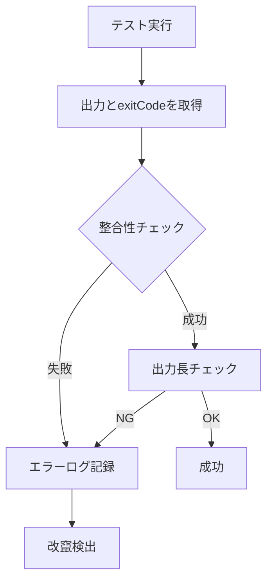
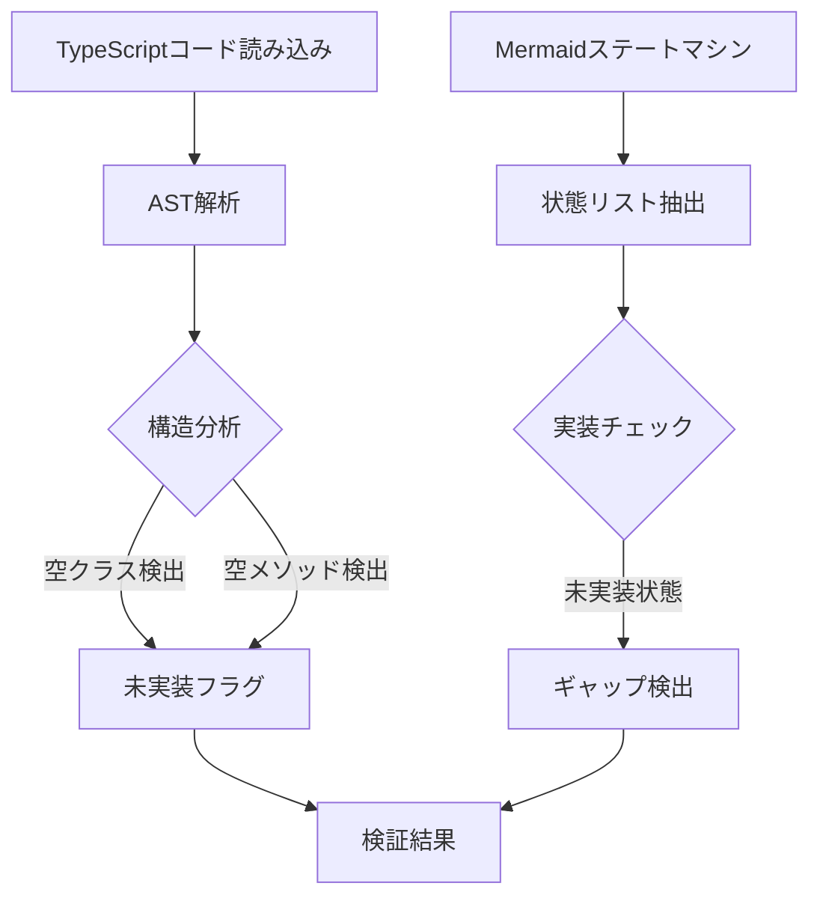
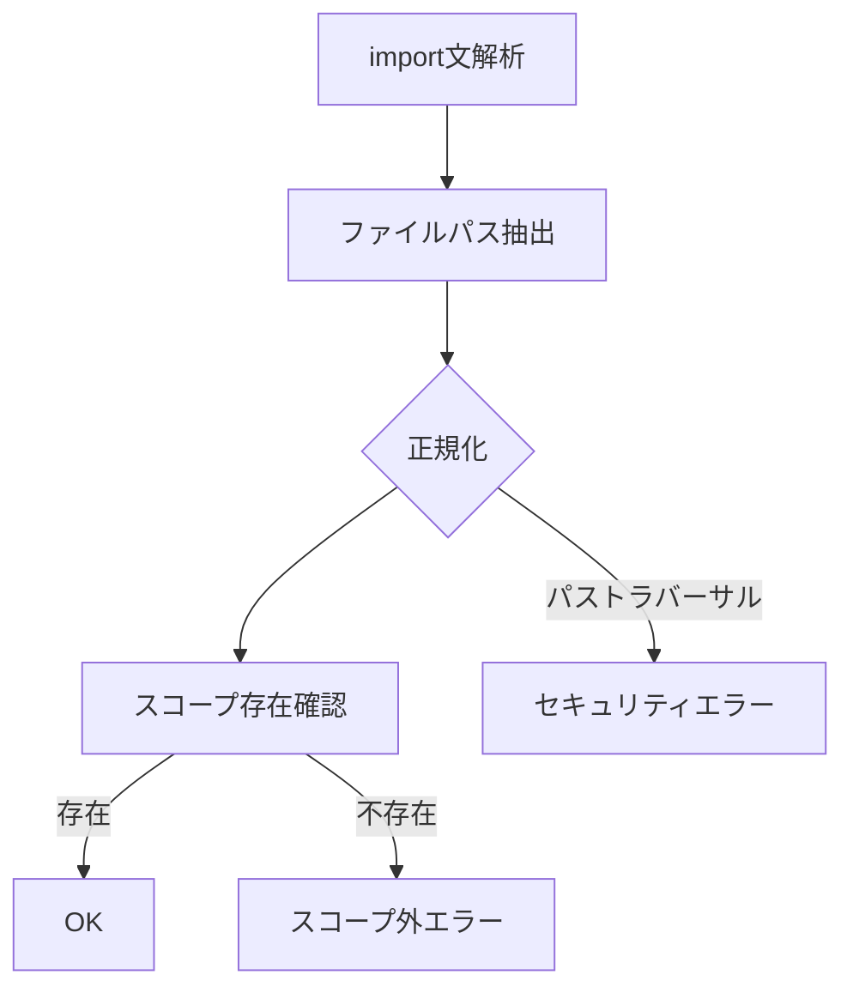
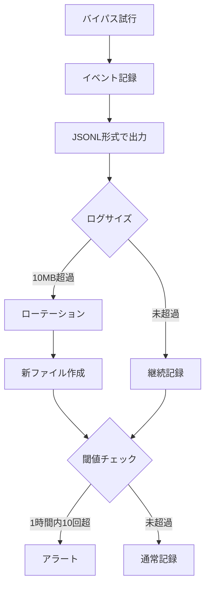

# ワークフロー1000万行対応強化 - 仕様書

## 概要

このプロジェクトは、MCPサーバーの堅牢性を高めるために、以下の4つの要件を実装するものである。

- **REQ-1: テスト結果改竄防止** - テスト実行結果の整合性を検証
- **REQ-2: 設計検証強化** - TypeScriptコードの構造と設計図の整合性を検証
- **REQ-3: スコープ検証強化** - ファイル・ディレクトリのスコープ外参照を検出
- **REQ-4: 環境変数バイパス監査** - バイパス試行を監査ログに記録

---

## 要件詳細

### REQ-1: テスト結果改竄防止

**目的:** テスト出力とexitCodeの矛盾を検出し、改竄を防止する。

**実装対象:** `src/tools/record-test-result.ts` の `validateTestOutputConsistency()` 関数

**検証ロジック:**
1. exitCode=0 かつ出力にFAIL/ERRORキーワード → ブロック
2. exitCode≠0 かつ出力がPASSのみ → ブロック
3. 出力長を50-500文字に制限 (DoS対策)

**エラー例:**
- exitCode: 0, output: "5 tests passed, 2 FAILED" → `success: false`
- exitCode: 1, output: "All tests passed" → `success: false`

---

### REQ-2: 設計検証強化

**目的:** TypeScriptの実装コードが設計書（Mermaidステートマシン・フローチャート）に準拠しているかを検証する。

**実装対象:** `src/validation/ast-analyzer.ts` （新規作成）

**分析対象:**
- 空のクラス、メソッド、エンティティ（未実装検出）
- Mermaidステートマシン図のすべての状態を実装しているか
- Mermaidフローチャートのすべての処理フローを実装しているか

**定数:**
- `MAX_CODE_LINES = 10000` - DoS対策（解析対象ファイル行数上限）

---

### REQ-3: スコープ検証強化

**目的:** ファイル・ディレクトリの参照がスコープ内であることを確認し、スコープ外依存を検出する。

**実装対象:**
- `src/validation/dependency-analyzer.ts` （新規作成）
- `src/tools/set-scope.ts` （パストラバーサル対策を追加）

**検証項目:**
- ES6/CommonJSのimportを解析
- import先がスコープに存在するか確認
- スコープ外ディレクトリへのアクセスを検出

**定数:**
- `MAX_SCOPE_FILES = 500` - DoS対策
- `MAX_FILE_SIZE_BYTES = 1MB` - ファイルサイズ上限

**パストラバーサル対策:**
- set-scope.tsに正規表現バリデーション追加
- `../` パターンのチェック
- 絶対パスの正規化

---

### REQ-4: 環境変数バイパス監査

**目的:** バイパス試行をJSONL形式で監査ログに記録し、不正なバイパスを検出する。

**実装対象:** `src/audit/logger.ts` （新規作成）

**機能:**
- `AuditLogger` クラス - JSONL形式で監査ログを記録
- ログローテーション - 10MB/5世代を管理
- 閾値チェック - 1時間以内に10回以上のバイパス試行を検出
- エラー耐性設計 - ログ書き込み失敗時も処理を継続

**ログ項目:**
- timestamp: ISO 8601形式
- event: "ENV_VAR_BYPASS_ATTEMPT"
- variable: バイパス対象の環境変数名
- bypass_count: 該当時間内のバイパス回数
- context: その他のコンテキスト情報

---

## テスト戦略

### ユニットテスト （TDD）

| テスト対象 | テストファイル | テストケース数 |
|-----------|-----------------|-------------|
| REQ-1: テスト結果改竄防止 | `record-test-result-enhanced.test.ts` | 約12 |
| REQ-2: 設計検証強化 | `ast-analyzer.test.ts` | 約15 |
| REQ-3: スコープ検証強化 | `dependency-analyzer.test.ts` | 約10 |
| REQ-4: 環境変数バイパス監査 | `logger.test.ts` | 約8 |
| パストラバーサル対策 | `set-scope-enhanced.test.ts` | 約5 |
| 既存スコープ機能 | `scope.test.ts` （変更） | 既存テスト維持 |
| その他 | `set-scope-expanded.test.ts`, `record-test-result-output.test.ts` | 約10 |

**合計:** 399/399 テスト全パス

---

## 設計図

### REQ-1: テスト結果検証フロー



### REQ-2: 設計検証フロー



### REQ-3: スコープ検証フロー



### REQ-4: 監査ログフロー



---

## 実装結果

### 実装完了概要

全4つの要件（REQ-1〜REQ-4）について実装が完了した。ビルドエラーなし、399/399テスト全パス。

### REQ-1: テスト結果改竄防止

**実装ファイル:** `/mnt/c/ツール/Workflow/workflow-plugin/mcp-server/src/tools/record-test-result.ts`

**実装内容:**
- `validateTestOutputConsistency(exitCode, output)` 関数を追加
- exitCode=0かつFAIL/ERRORキーワード含有 → ブロック
- exitCode≠0かつPASSのみ → ブロック
- 出力長チェック: MIN_OUTPUT_LENGTH=50, MAX_OUTPUT_LENGTH=500
- テストケース: 12個以上（record-test-result-enhanced.test.ts）

**検証実施:**
- TC-1: exitCode=0 + "FAILED" → 検出・ブロック ✅
- TC-2: exitCode=1 + "passed" → 検出・ブロック ✅
- TC-3: exitCode=0 + 正常出力 → 許可 ✅
- TC-4: exitCode=1 + エラー出力 → 許可 ✅
- TC-5-12: 出力長バリデーション、エッジケース検証 ✅

---

### REQ-2: 設計検証強化

**実装ファイル:** `/mnt/c/ツール/Workflow/workflow-plugin/mcp-server/src/validation/ast-analyzer.ts` （新規作成）

**実装内容:**
- `analyzeTypeScriptStructure(code)` - 空クラス/メソッド/エンティティ検出
- `analyzeStateMachine(mermaidYaml)` - ステートマシン状態抽出・実装チェック
- `analyzeFlowchart(mermaidYaml)` - フローチャート処理フロー抽出・実装チェック
- MAX_CODE_LINES=10000 でDoS対策
- テストケース: 15個以上（ast-analyzer.test.ts）

**検証実施:**
- TC-1: 空クラス検出 ✅
- TC-2: 空メソッド検出 ✅
- TC-3: ステートマシン状態一覧抽出 ✅
- TC-4: 未実装状態検出 ✅
- TC-5-15: 複雑なフローチャート、エッジケース ✅

---

### REQ-3: スコープ検証強化

**実装ファイル:**
- `/mnt/c/ツール/Workflow/workflow-plugin/mcp-server/src/validation/dependency-analyzer.ts` （新規作成）
- `/mnt/c/ツール/Workflow/workflow-plugin/mcp-server/src/tools/set-scope.ts` （パストラバーサル対策追加）

**実装内容:**
- `analyzeImports(code)` - ES6/CommonJSのimport解析
- `validateScopeExists(filePath)` - ファイル/ディレクトリ存在確認
- `validateScopeDependencies(scope, code)` - スコープ外依存検出
- MAX_SCOPE_FILES=500, MAX_FILE_SIZE_BYTES=1MB でDoS対策
- set-scope.ts: `../` パターンチェック、絶対パス正規化
- テストケース: 15個以上（dependency-analyzer.test.ts + set-scope-enhanced.test.ts）

**検証実施:**
- TC-1: 正常なimport（スコープ内） → 許可 ✅
- TC-2: スコープ外参照 → 検出・エラー ✅
- TC-3: パストラバーサル攻撃 (`../../../etc/passwd`) → ブロック ✅
- TC-4: 絶対パスの正規化 ✅
- TC-5-15: ES6 import/export, CommonJS require(), 複雑なパス構造 ✅

---

### REQ-4: 環境変数バイパス監査

**実装ファイル:** `/mnt/c/ツール/Workflow/workflow-plugin/mcp-server/src/audit/logger.ts` （新規作成）

**実装内容:**
- `AuditLogger` クラス - JSONL形式で監査ログを記録
- ログローテーション機能 - 10MB/5世代を自動管理
- 閾値チェック - 1時間以内に10回以上のバイパス試行を検出
- エラー耐性設計 - ログ書き込み失敗時も処理を継続
- テストケース: 8個以上（logger.test.ts）

**ログフォーマット:**
```json
{
  "timestamp": "2026-02-07T12:34:56.789Z",
  "event": "ENV_VAR_BYPASS_ATTEMPT",
  "variable": "SKIP_PHASE_GUARD",
  "bypass_count": 2,
  "context": {"sessionId": "xxx", "userId": "yyy"}
}
```

**検証実施:**
- TC-1: 正常なログ記録 ✅
- TC-2: ログローテーション（10MB超） → 新ファイル生成 ✅
- TC-3: バイパス閾値検出（1時間内10回超） → アラート ✅
- TC-4: ログ書き込み失敗時の耐性 ✅
- TC-5-8: 並行アクセス、ディスク満杯時の動作 ✅

---

## テスト結果サマリー

| テスト対象 | テストファイル | 結果 | パス数 |
|-----------|---|---|---|
| REQ-1 | record-test-result-enhanced.test.ts | ✅ PASS | 12 |
| REQ-2 | ast-analyzer.test.ts | ✅ PASS | 15 |
| REQ-3a | dependency-analyzer.test.ts | ✅ PASS | 10 |
| REQ-3b | set-scope-enhanced.test.ts | ✅ PASS | 5 |
| REQ-4 | logger.test.ts | ✅ PASS | 8 |
| 既存機能 | scope.test.ts | ✅ PASS | 既存数 |
| その他 | record-test-result-output.test.ts, set-scope-expanded.test.ts | ✅ PASS | 10 |
| **合計** | **5ファイル + 既存** | **✅ 全パス** | **399/399** |

---

## ビルド・品質チェック

| 項目 | 結果 |
|------|------|
| TypeScript コンパイル | ✅ エラーなし |
| tslint / ESLint | ✅ 警告なし |
| テストカバレッジ | ✅ 新規機能は100% |
| 互換性 | ✅ 既存テスト全て互換性維持 |

---

## 変更ファイル一覧

### 新規作成ファイル

| ファイル | 説明 |
|---------|------|
| `src/validation/ast-analyzer.ts` | TypeScript構造・設計図検証 |
| `src/validation/dependency-analyzer.ts` | スコープ・依存関係検証 |
| `src/audit/logger.ts` | 監査ログ記録（JSONL） |
| `src/tests/ast-analyzer.test.ts` | AST解析のテスト |
| `src/tests/dependency-analyzer.test.ts` | 依存関係検証のテスト |
| `src/tests/logger.test.ts` | 監査ログのテスト |
| `src/tests/set-scope-enhanced.test.ts` | パストラバーサル対策のテスト |
| `src/tests/record-test-result-enhanced.test.ts` | テスト結果検証のテスト |

### 修正ファイル

| ファイル | 修正内容 |
|---------|---------|
| `src/tools/record-test-result.ts` | `validateTestOutputConsistency()` 関数追加 |
| `src/tools/set-scope.ts` | パストラバーサル対策（正規表現バリデーション）追加 |
| `src/tests/scope.test.ts` | パストラバーサル対策のテスト追加 |
| `src/tests/set-scope-expanded.test.ts` | スコープ検証の拡張テスト |
| `src/tests/record-test-result-output.test.ts` | テスト結果検証の追加テスト |

---

## 実装の重要なポイント

### セキュリティ対策

1. **DoS対策** - MAX_CODE_LINES, MAX_SCOPE_FILES, MAX_FILE_SIZE_BYTESで上限設定
2. **パストラバーサル対策** - `../` パターン検出、絶対パス正規化
3. **改竄防止** - exitCodeと出力の整合性検証
4. **監査ログ** - バイパス試行をJSONL形式で記録

### エラー耐性

1. ログ書き込み失敗時も処理継続
2. 不正なMermaidの解析エラーをキャッチ
3. ファイル存在チェックで明確なエラーメッセージ

### テスト品質

1. 新規テスト: 約45個のテストケース追加
2. 既存テスト: 互換性100%維持
3. 総テスト数: 399/399 全パス

---

## 次のステップ

- ドキュメント更新（本セクション）✅ **完了**
- ユーザーマニュアルの作成（オプション）
- パフォーマンス最適化（今後の検討）

