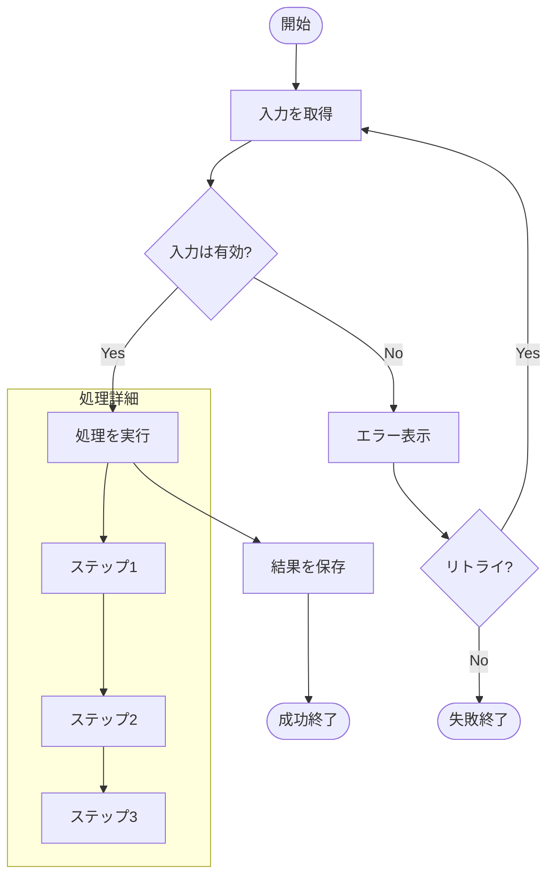
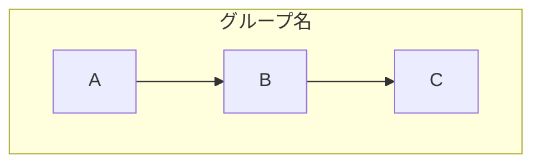

# Flowchart フェーズ

## subagent実行

このフェーズは**subagentとして実行**される。
**並列フェーズ (parallel_design)** の一部として実行される。

---

## 目的

処理フローを Mermaid フローチャートで可視化する。

## 入力

- タスクディレクトリ: `{workflowDir}`
- 要件: `requirements.md`
- ステートマシン図: `state-machine.mmd`

## 実行手順

1. **処理の開始・終了を特定**
   - エントリポイント
   - 正常終了
   - エラー終了

2. **分岐条件を特定**
   - if/else 条件
   - switch/case
   - ループ条件

3. **処理ステップを記述**
   - 各処理ノード
   - サブルーチン呼び出し

4. **Mermaid図の作成**
   - `flowchart TD` 記法で記述
   - `docs/specs/domains/{domain}/` に保存

## 出力ファイル

### `docs/specs/domains/{domain}/{name}.flowchart.mmd`



## 記法ガイド

### ノード形状

```mermaid
flowchart TD
    A([開始/終了])      %% 角丸
    B[処理]             %% 四角
    C{条件分岐}         %% ひし形
    D[(データベース)]    %% 円筒
    E[[サブルーチン]]    %% 二重線
    F((接続点))         %% 円
```

### 矢印

```mermaid
flowchart TD
    A --> B            %% 通常
    A -->|ラベル| B    %% ラベル付き
    A -.-> B           %% 点線
    A ==> B            %% 太線
```

### サブグラフ



### 方向

```mermaid
flowchart TD   %% 上から下
flowchart LR   %% 左から右
flowchart BT   %% 下から上
flowchart RL   %% 右から左
```

## 禁止事項

- コードの編集
- 実装の開始
- ASCII図での作成（Mermaid必須）

## 完了条件

- [ ] 開始・終了を明確化した
- [ ] 全ての分岐条件を網羅した
- [ ] エラーフローを記述した
- [ ] Mermaid図を docs/specs/ に作成した
