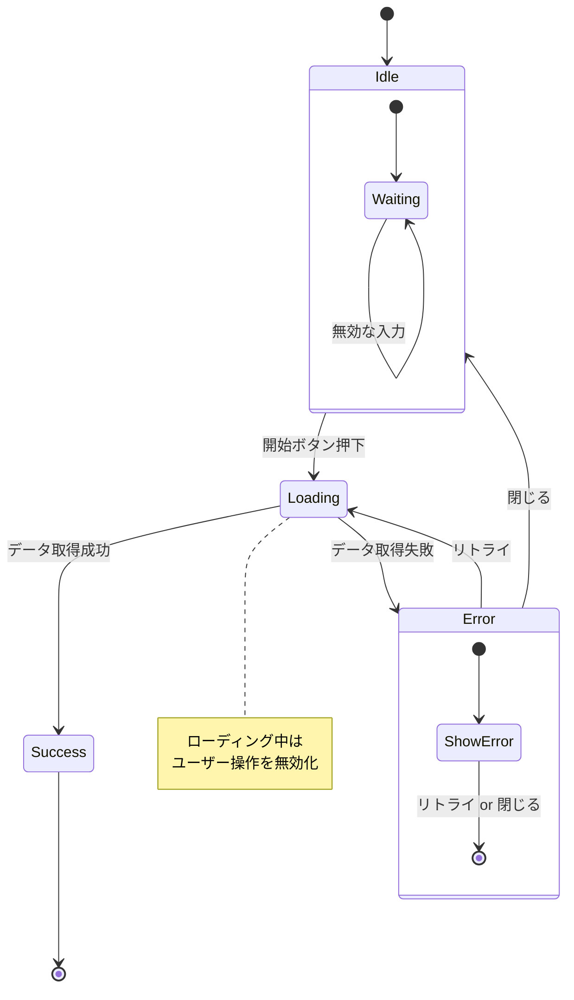
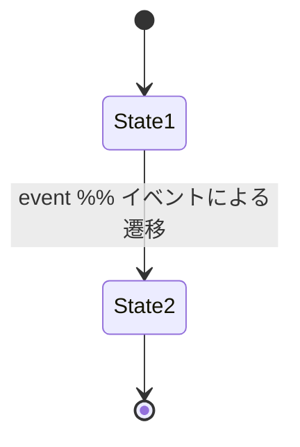
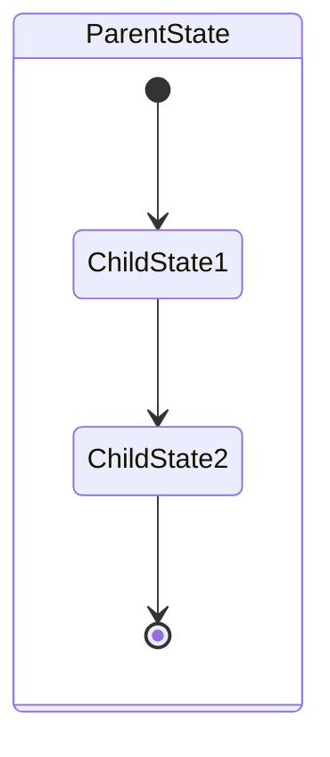
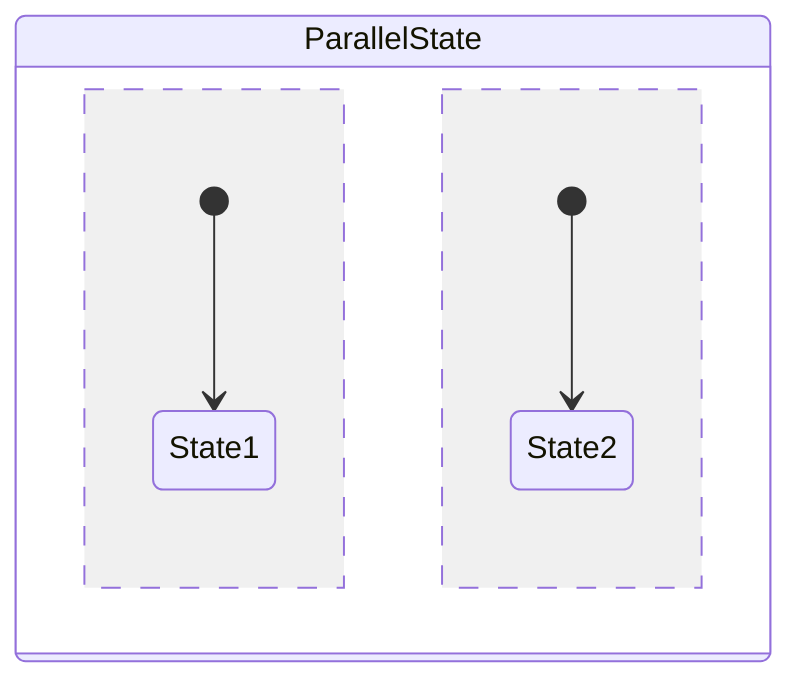
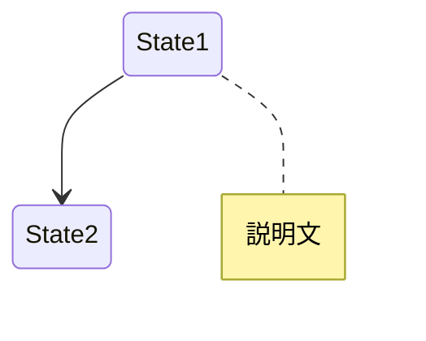

# State Machine フェーズ

## subagent実行

このフェーズは**subagentとして実行**される。
**並列フェーズ (parallel_design)** の一部として実行される。

---

## 目的

機能の状態遷移を Mermaid ステートマシン図で可視化する。

## 入力

- タスクディレクトリ: `{workflowDir}`
- 要件: `requirements.md`
- 調査結果: `research.md`

## 実行手順

1. **状態の特定**
   - 初期状態
   - 中間状態
   - 終了状態
   - エラー状態

2. **イベント/トリガーの特定**
   - 状態を変化させるアクション
   - 条件分岐

3. **状態遷移の記述**
   - 各状態間の遷移を定義
   - ガード条件を記述

4. **Mermaid図の作成**
   - `stateDiagram-v2` 記法で記述
   - `docs/specs/domains/{domain}/` に保存

## 出力ファイル

### `docs/specs/domains/{domain}/{name}.state-machine.mmd`

## 記法ガイド

### 基本構文

### 複合状態

### 並行状態

### ノート

## 禁止事項

- コードの編集
- 実装の開始
- ASCII図での作成（Mermaid必須）

## 完了条件

- [ ] 全ての状態を特定した
- [ ] 全てのイベント/トリガーを定義した
- [ ] エラー状態を網羅した
- [ ] Mermaid図を docs/specs/ に作成した
